# PhillyStat360. A Spatial Machine Learning Model for Residential Vacancy in Philadelphia

A machine learning pipeline that predicts vacant property risk across Philadelphia residential parcels using administrative data from the Office of Property Assessment (OPA), the Department of Licenses and Inspections (L&I), and the Philadelphia Revenue Department. The output is a parcel-level predicted probability of vacancy for every residential property in the city, plus a calibrated 0 to 100 risk score, an ensemble flag for the top one percent of parcels, and a five-tier rank bucket for dashboard display.

---

## Repository Layout

```
code/r_code/        Full R Markdown pipeline. Steps 00 through 06.
code/outputs/       Rendered HTML reports plus a handful of standalone PNGs
                    used in early-stage EDA write-ups.
code/03_*_files/    Auto-generated figure folders from knitting the Rmd files.
graphs/             Headline figures used across documentation.
graphs/python/      Modeling and validation figures. The folder name is
                    historical — every file in it is now produced by the R
                    pipeline.
website/            Static dashboard, landing page, PMTiles, ward GeoJSON, and
                    the optional local Flask backend (tileserver.py + load_db.py).
```

## Pipeline Overview

```
── Manual once to establish labels and reference ────────────────────────────
00_data_inventory       data reference and OVS definition
00b_new_data_check      quality check for new data sources
02_ovs_exploration      understand the dependent variable
03_1_Ovs                construct OVS label  →  ovs_residential.csv
03_2_Analysis           tier mapping, EDA, baseline model (AUC 0.798)
03_3_Features           full feature matrix  →  features_residential.csv

── Modeling and validation ──────────────────────────────────────────────────
04a_tidymodeling        Logit, RF, XGBoost, LightGBM and 50 / 50 calibrated ensemble
                              →  data_py/all_predictions_rf.csv
                              →  data_py/model_*_final.rds
                              →  data_py/calibrators.rds
                              →  data_py/model_thresholds.csv
          ↓
04b_model_validation    spatial CV by ZIP group, LOGO CV, RF tree-variance CIs
04b_vpi_comparison      per-ZIP, per-building-type, per-ward, equity by income
04c_vs_city_vpi         head-to-head against the City Vacant Property Indicator
04d_recalibration       held-out isotonic refit (calibrators_v2.rds)
04e_operational_thresholds  per-ward capacity flagging, model vs VPI vs union
04f_local_explanations  TreeSHAP on top-flagged parcels
04g_temporal_validation evaluation by violation-recency cohort
04h_block_cv_rf         GroupKFold by census tract for an honest AUC
          ↓
05_output_analysis      probability summaries, ZCTA choropleth, capacity lookup
06_tiling               PMTiles vector tilesets for web consumption

── Public-facing surface (in website/) ──────────────────────────────────────
Vacancy Risk Landing Page.html    project landing page
PhillyStat360 v2.html             full methodology write-up
dashboard.html                    interactive parcel-level dashboard
*.pmtiles                         vector tilesets streamed to the browser
tileserver.py + load_db.py        optional Flask backend backed by PostGIS
```

---

## Running the Pipeline

The whole pipeline is R Markdown end to end and lives in `code/r_code/`. Modeling, validation, calibration, explainability, and tiling all run in R using `tidymodels`, `ranger`, `xgboost`, `lightgbm` (via `bonsai`), `probably` for calibration, and `treeshap` for local explanations. The `data_py/` output folder name is historical — it is just where every step reads from and writes to.

The early steps (00 to 03_3) load raw OpenDataPhilly extracts, validate quality, define the outcome variable, and engineer the feature matrix. They are run once whenever raw inputs change. They produce two flat tables that downstream steps consume:

- `data/ovs_residential.csv`. Around 352K residential parcels with the OVS label and source flags.
- `data/features_residential.csv`. The same parcels with around 80 engineered features.

Each Rmd reads its inputs from `data/` or `data_py/`, writes outputs back to `data_py/`, and knits a self-contained HTML rendering next to itself. The files have a strict left-to-right dependency. 04a fits the four base learners and the calibrated ensemble. 04b through 04h consume those fitted artefacts for validation. 05 produces the stakeholder-facing summaries, and 06 turns the parcel GeoJSON into PMTiles for the website.

To re-run the pipeline end to end, knit the Rmd files in alphabetical order. Each step caches its expensive computations under `data_py/cache/` keyed by a SHA-1 of the feature list, so re-runs are fast as long as the feature set has not changed. Deleting `data_py/cache/` forces a clean refit.

---

## Step-by-Step Documentation

---

### Step 1. Data Inventory and Reference

**File.** [`code/r_code/00_data_inventory.Rmd`](code/r_code/00_data_inventory.Rmd)

This file is the reference layer for the entire project. It establishes the vocabulary, the data quality picture, and the definition of the outcome variable before any analysis begins.

#### 1.1 Load and profile all eight raw datasets

All source files are loaded from `rawdata/` and printed with row counts, column names, and a `glimpse()`. The eight datasets are described below.

| Dataset | Source | Contents |
|---|---|---|
| `opa_properties_public.csv` | OPA | Around 583K parcel records. Property characteristics, zoning, assessed values, sale history |
| `violations.csv` | L&I | Full code violation history with violation code, date, and status (open, complied, closed) |
| `business_licenses.csv` | L&I | License history per parcel with revenue code, status, and issue dates |
| `clean_seal.csv` | L&I | City-initiated board-up and securing actions with case date and work order status |
| `unsafe.csv` | L&I | Unsafe structure orders |
| `imm_dang.csv` | L&I | Imminently dangerous structure orders |
| `assessments.csv` | OPA | Historical assessment records |
| `VIOLATION_DEFINITION.csv` | L&I | Lookup table from violation code to title and definition text |

Profiling upfront prevents silent data errors downstream. Knowing a field has 40 percent missing values, or that date ranges only go back to 2010, shapes every subsequent design decision.

#### 1.2 Field-level data dictionaries

For each dataset a kable table is generated with field name, data type, example values, and a plain-English description. Missing-value rates are computed for every column. The dictionary serves as the living reference for the team. Rather than each person re-reading the raw files, the dictionary documents what each field means in context.

#### 1.3 Define the OVS (Observed Vacancy Status) outcome variable

The OVS definition is formalized here and carried unchanged through the entire pipeline. A parcel has OVS equal to one if it meets any of the following.

1. **Clean & Seal.** Appears in L&I Clean & Seal records within a two-year window of the training cutoff, and has no subsequent demolition or new construction permit.
2. **Open Vacant Violation.** Has an OPEN violation with one of eleven specific vacancy codes. `9-3904`, `9-3905`, `PM15-901.1`, `PM15-901.2`, `PM15-301`, `CP-102`, `CP-103`, `PM-102.4/1`, `PM-102.4/2`, `PM-102.4/3`, `PM-102.4/4`.
3. **Active Vacant License.** Holds an Active business license with revenue code `3219` (Residential Vacant) or `3634` (Commercial Vacant).

Using three independent administrative systems triangulates vacancy more reliably than any single source. Clean & Seal captures severe cases the city has physically intervened on. The violation codes capture properties flagged by inspectors during routine or complaint-driven inspections. Vacant licenses capture owners who have self-declared vacancy to the city, often to qualify for reduced tax treatment.

#### 1.4 Catalog vacancy-related violation codes

All 54 violation codes whose title or definition text contains the word "vacant" are enumerated. These are separated from the eleven OVS-defining codes. The remaining 43 are vacancy-adjacent signals used in feature engineering without being part of the label itself.

#### 1.5 Computed OVS statistics

- Overall observed vacancy rate. Around 8.3 percent of all parcels (48,671 of 583,802).
- After filtering to residential. Around 1.1 percent.
- Source breakdown of OVS equal to one. Clean & Seal 88.4 percent, violation only 3.6 percent, license only 1.9 percent, and overlapping 6.1 percent.

A key finding falls out of this. Clean & Seal dominates the label. The model will largely learn to predict which properties the city has already physically boarded up, plus catch earlier-stage signals for properties that have not yet reached that point.

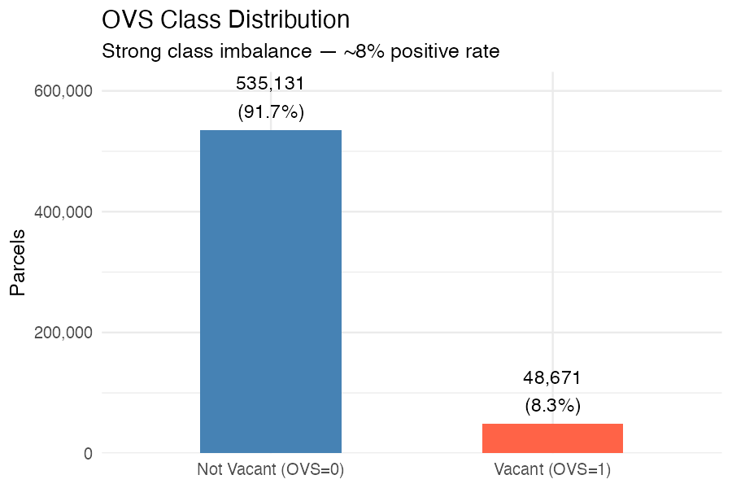

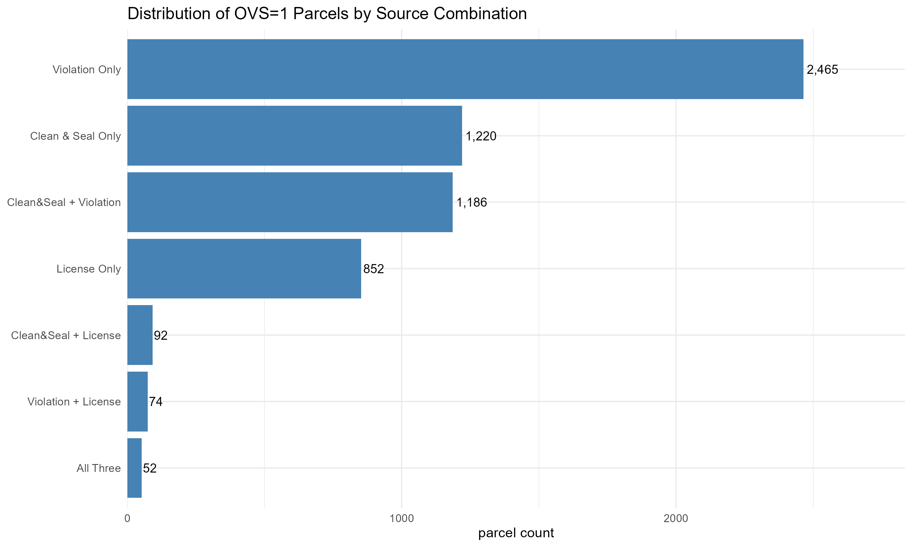

---

### Step 2. New Data Quality Check

**File.** [`code/r_code/00b_new_data_check.Rmd`](code/r_code/00b_new_data_check.Rmd)

#### 2.1 Real Estate Transfer records (RTT_SUMMARY)

The RTT dataset is loaded and profiled. Key checks include:

- Join key detection. Scans column names for `opa`, `parcel`, or `account` to find the field that links to `opa_properties_public`. Confirmed as `opa_account_num`.
- Match rate. The fraction of RTT records whose `opa_account_num` appears in the OPA parcel table.
- Date range. `display_date` is checked for min and max to confirm temporal coverage.
- Document type distribution. Counts by `document_type` such as DEED, DEED SHERIFF, MORTGAGE, AGREEMENT OF SALE. This is needed in order to separate arms-length sales from encumbrances.

RTT contains the full deed and transfer history, which is richer than the single most-recent `sale_date` and `sale_price` already in OPA. Rapid re-sales and sheriff (foreclosure) sales are distress signals that predict vacancy independently of physical condition.

#### 2.2 Building and zoning permits

Permits are loaded and profiled similarly. The join key is confirmed as `opa_account_num`, and the `permittype`, `typeofwork`, and `status` distributions are checked.

Permits serve two roles in the pipeline. First, demolition permits after a Clean & Seal event remove the parcel from the active vacancy list. Second, new construction permits signal that a formerly vacant lot has been redeveloped. Both scenarios would make the OVS label stale if not accounted for.

---

### Step 3. OVS Exploratory Analysis

**File.** [`code/r_code/02_ovs_exploration_JF.Rmd`](code/r_code/02_ovs_exploration_JF.Rmd)

#### 3.1 Construct OVS across all parcels (no residential filter)

All three OVS sources are assembled on the full OPA parcel universe and joined with PWD parcel geometry. The wider scope (all parcels, not just residential) allows exploration of false positives in commercial and industrial properties before the residential filter is applied.

#### 3.2 OVS source overlap analysis

A bar chart shows how many OVS-equal-one parcels are flagged by only one source versus combinations of two or three. The breakdown matches the inventory in step 1. Clean & Seal alone accounts for the bulk of the label, with the other two sources contributing smaller exclusive shares and a long tail of overlap.

Source overlap matters for the model. Parcels flagged by multiple sources are very likely truly vacant and carry high label confidence. Parcels flagged by only one source may have higher label noise, which affects how the model should weigh predictions in different probability ranges.

#### 3.3 OVS-equal-one versus OVS-equal-zero parcel characteristics

Box plots and summary statistics compare vacant against occupied parcels across:

- Market value. Vacant median around 145K versus occupied around 222K.
- Exterior condition on a 1 to 7 scale. Vacant parcels skew heavily toward 5, 6, and 7.
- Year built. Vacant parcels tend to be older.
- Livable area. Vacant parcels tend to be smaller.

These differences validate that the administrative OVS label corresponds to physical deterioration signals in OPA assessment data, confirming the outcome is measuring what we think it is.

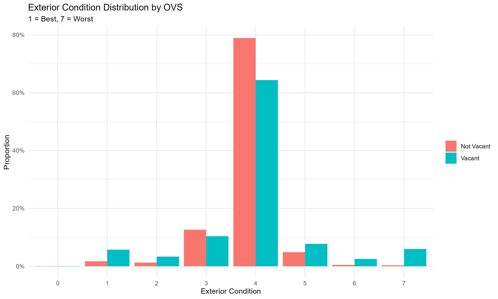

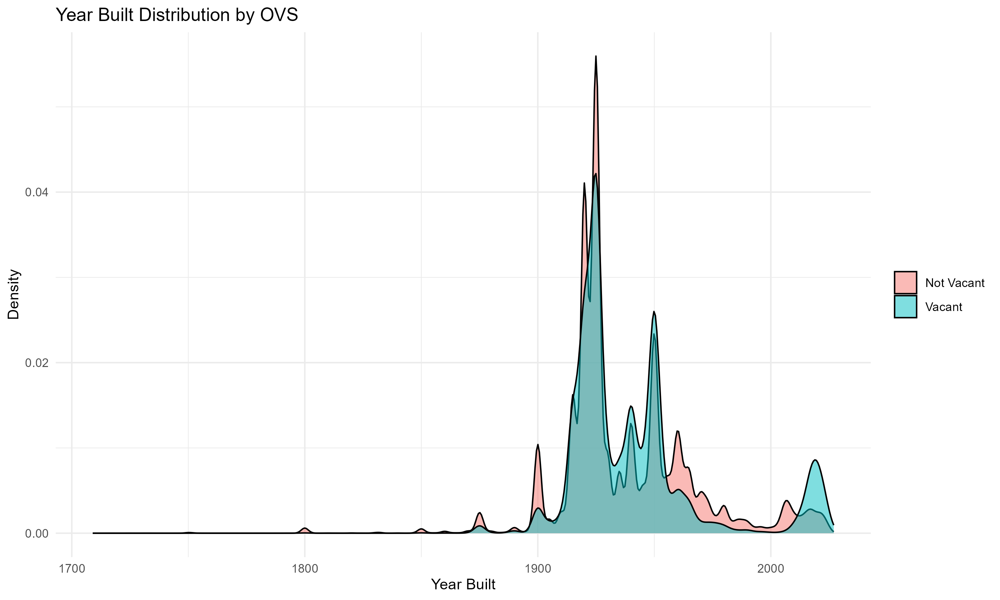

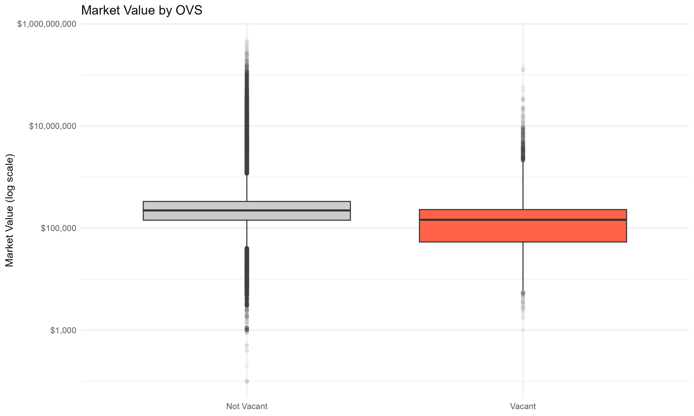

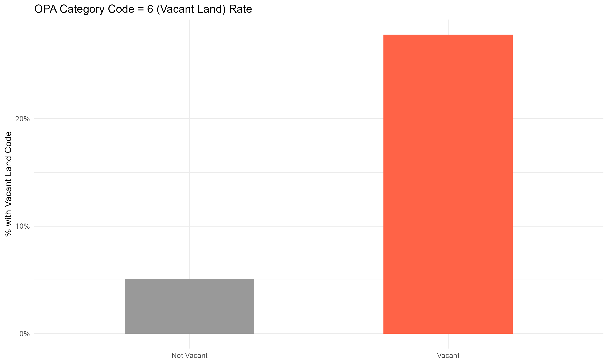

#### 3.4 Spatial summary by ZIP code

Vacancy rates are computed per ZIP code and ranked. Rates range from around 0.3 percent in newer or wealthier areas to around 17 percent in areas with concentrated disinvestment. The large spatial variation confirms that vacancy is not randomly distributed. It clusters geographically. This finding directly motivated the spatial cross-validation work in step 8.

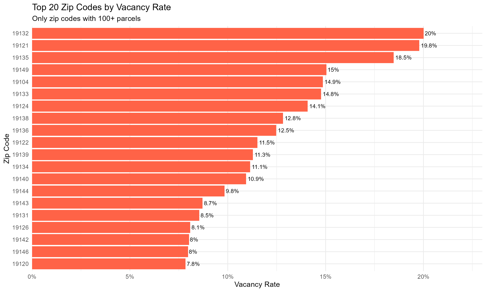

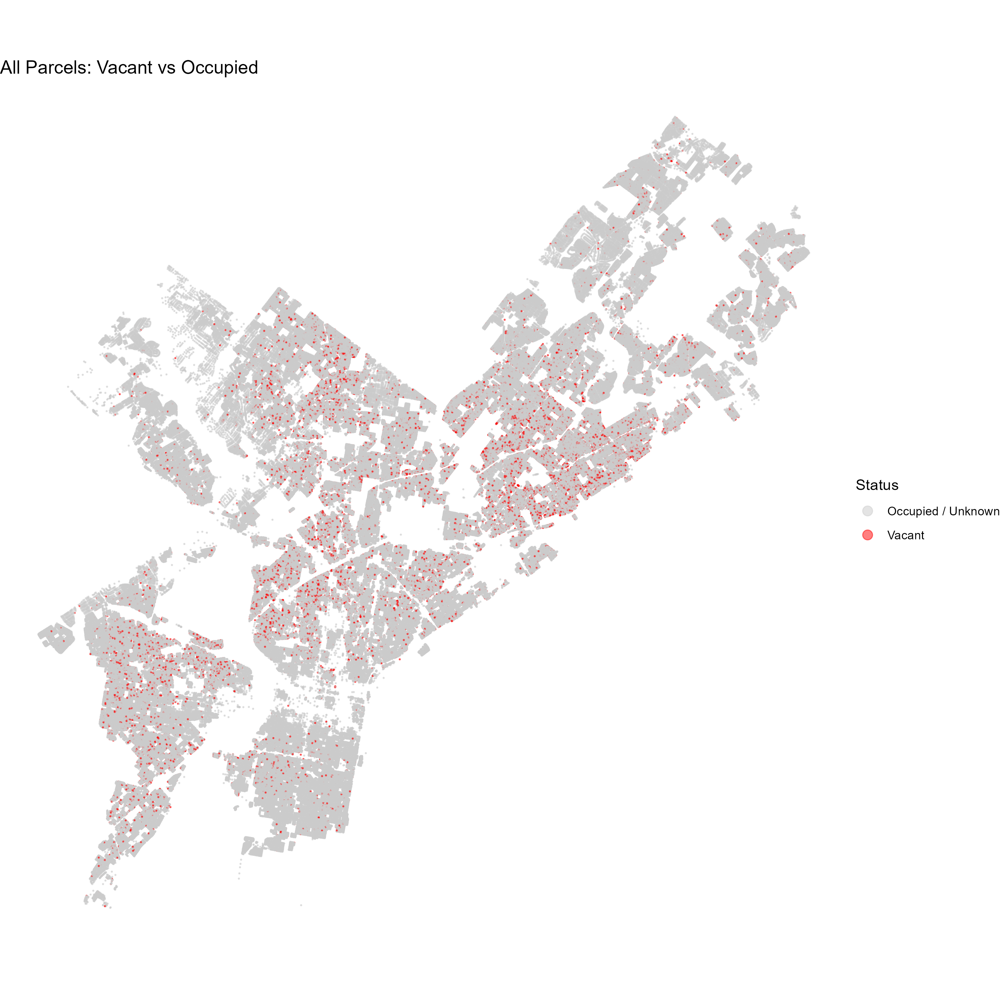

#### 3.5 Three case-study parcel drill-downs

Three specific parcels are selected and their full administrative history is reconstructed across all violation records, license records, C&S events, and permit activity.

- **Case 1, severe vacancy.** A parcel with Clean & Seal records, open violations, and lapsed licenses. Confirms the three-source composite correctly identifies clear vacants.
- **Case 2, commercial false positive.** A parking garage flagged by code `PM15-901.1`. The code is in the OVS definition but applies to vacant property maintenance. Parking lots can receive it without being vacant in the residential sense. This case directly led to the commercial and parking filter that lives in `03_3_Features.Rmd`.
- **Case 3, false negative.** An OPA category 6 (Vacant Land) parcel with no violation, license, or C&S signal. Genuinely vacant land is largely invisible to the three-source OVS definition, which motivated treating land separately rather than forcing it through the building model.

---

### Step 4. OVS Construction (Residential Only)

**File.** [`code/r_code/03_1_Ovs.Rmd`](code/r_code/03_1_Ovs.Rmd)

This file is the single source of truth for the model's outcome variable. Every downstream file reads `ovs_residential.csv` rather than re-constructing OVS independently.

#### 4.1 Set the temporal anchor

`TRAIN_CUTOFF` is fixed at `2025-10-01` globally. Every feature and every OVS source must use data strictly before this date. This prevents any information from after the cutoff from leaking into the model.

#### 4.2 Source 1, Clean & Seal with two Fichman filters

```r
cs_parcels <- clean_seal %>%
  filter(casecreateddate >= (TRAIN_CUTOFF - years(2))) %>%  # filter 1, 2-year window
  anti_join(demo_after_seal, by = "opa_account_num")        # filter 2, demolition
```

The first filter, the two-year window, exists because a C&S record from five years ago does not necessarily mean the building is still vacant today. Using only records from within the last two years keeps the label current. This was a specific requirement from Fichman.

The second filter, the demolition filter, removes parcels where a completed demolition permit followed the C&S action. The building was torn down. The parcel is no longer a vacant building. It is an empty lot. Keeping it as OVS-equal-one would be a false positive for the building model.

#### 4.3 Source 2, open vacant violations

Only violations with `violationstatus == "open"` and a code in the eleven-code OVS list are included. Closed or complied violations mean the issue was resolved. The property may have been remediated and should not be labeled as currently vacant.

#### 4.4 Source 3, active vacant property license

Only licenses with `licensestatus == "active"` and revenue codes `3219` or `3634` are included. An expired or inactive vacant license means the owner no longer holds that designation.

#### 4.5 Merge and compute OVS

All three source flags are left-joined to the OPA property table and combined with `OVS = if_else(ovs_cs == 1 | ovs_viol == 1 | ovs_lic == 1, 1, 0)`. The individual source flags are retained so downstream analysis can decompose the label.

#### 4.6 Filter to residential only

`filter(category_code %in% c("1", "2", "3", "14"))` removes commercial (4, 5), industrial (implicit), vacant land (6), and other non-residential categories. The modeling pipeline is scoped to buildings only, and residential buildings specifically. Commercial properties would require different feature vocabularies and would reintroduce the parking garage false-positive problem identified in step 3.

The four included categories are.

- `1`. Single Family.
- `2`. Multi-Family, Duplex, Triplex.
- `3`. Mixed Use (residential plus commercial).
- `14`. Large Apartment Buildings (4 or more units).

#### 4.7 Join PWD parcel geometry and export

Geometry from `PWD_PARCELS.geojson` is joined to attach `bldg_desc` (building description from the parcel layer), `shape_area`, and `shape_length`. Geometry is dropped on export since downstream files work with flat tables, but `bldg_desc` is retained. It gets used in `03_3_Features.Rmd` to filter parking garages.

**Output.** `data/ovs_residential.csv`. Around 352K residential parcels with an OVS-equal-one rate of around 1.1 percent.

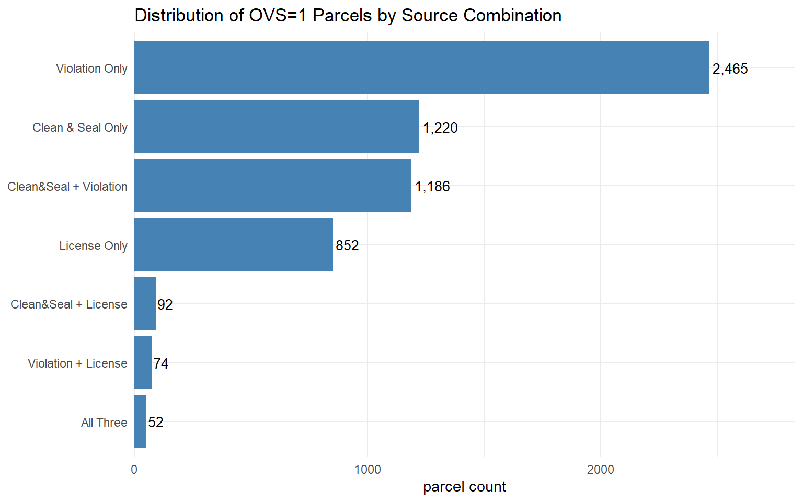

---

### Step 5. Violation Tier Mapping, EDA, and Baseline Model

**File.** [`code/r_code/03_2_Analysis.Rmd`](code/r_code/03_2_Analysis.Rmd)

#### 5.1 Define the VacancyGuide violation tier scheme

108 L&I violation codes are manually mapped to three severity tiers based on the VacancyGuide2026 methodology developed by Tim Haynes.

| Tier | Weight | Description | Code Count |
|---|---|---|---|
| Level 1 | +1 | Minor deterioration and general maintenance such as broken windows, debris, peeling paint | 26 |
| Level 2 | +2 | Moderate structural damage such as deteriorated masonry, structural members, roofing | 19 |
| Level 3 | +3 | Severe vacant or unsafe or collapse risk including structural failure, imminently dangerous conditions, known vacancy codes | 63 |

A separate list of nine codes for the land model (`guide_land`) is documented here but not used in the building model.

A caveat from Fichman's 2026-02-18 review applies. The tier weights were established by trial and error by Tim Haynes without statistical validation. They are used in the Track B comparison model to benchmark against the domain-expert heuristic, but they are not used as primary model inputs. The engineered model in Track A learns its own weights from data. A duplicate check via `stopifnot` confirms no violation code appears in more than one tier.

#### 5.2 Validate tier codes against real violation data

The 108 tier codes are matched against the actual violations dataset to count how many OPEN violations exist per tier in the current data. This confirms the codes are actively used (not hypothetical) and checks that Level 3 codes dominate OPEN violations as expected.

#### 5.3 Identify the 54 vacancy keyword codes

The `VIOLATION_DEFINITION.csv` table is scanned for any code whose title or definition contains the word "vacant". This yields 54 codes, a superset of the eleven OVS-defining codes. They are used in feature engineering as a softer vacancy signal.

The eleven OVS codes define the label, so using them as features would create direct leakage. The 54-code keyword set captures a broader universe of vacancy-related violations that are not direct components of the label, which provides predictive signal without circularity.

#### 5.4 EDA, exterior condition versus vacancy rate

Vacancy rates are computed for each exterior condition rating (1 for New or Excellent through 7 for Collapsed or Deteriorated) and plotted as a bar chart. As expected, condition equal to seven shows dramatically higher vacancy rates than condition equal to one.

A violin plot was initially used here, but Fichman pushed back. Exterior condition is an ordered categorical variable, not continuous. Bar charts are more honest about the discrete scale.

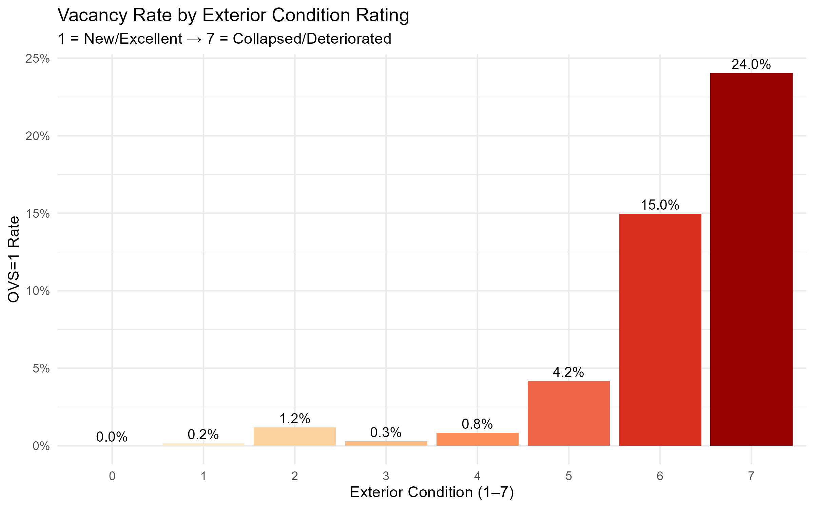

#### 5.5 EDA, new-construction false positive check

Properties built after 2010 and labeled OVS-equal-one are isolated and their source breakdown is compared to the overall OVS-equal-one population. This was a specific Fichman question. Why would a newly built property be labeled vacant. The analysis reveals whether these are genuine vacants (construction never occupied) or data artefacts such as a C&S record on a wrong parcel.

#### 5.6 EDA, violation history across time windows

Mean violation counts in four windows (all-time, five-year, three-year, six-month) are computed separately for OVS-equal-one and OVS-equal-zero parcels and plotted in a 2 by 2 faceted bar chart.

The key finding is that OVS-equal-one parcels have consistently higher violation counts across every window. The gap narrows in the six-month window, suggesting that acute recent activity is a weaker signal than long-term chronic history. This validates the life-history features engineered in step 6.

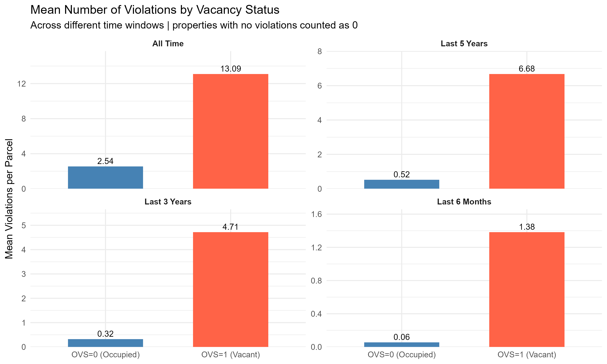

#### 5.7 Baseline logistic regression (OPA fields only)

A logistic regression is fit using only four OPA property fields (exterior condition, log of market value, building age, and log of livable area), with no violation, license, or transfer features. This establishes the performance floor that any engineered model must beat.

- Model. `ovs ~ exterior_condition + log_market_value + building_age + log_livable_area`.
- Dataset. 276K parcels with non-missing values on all four fields.
- Baseline AUC. **0.798**.

The Youden-optimal threshold is found from the ROC curve. A probability density plot overlays the predicted score distributions for OVS-equal-zero and OVS-equal-one parcels. Visible overlap in the middle range indicates room for improvement. The confusion matrix and odds ratios are reported.

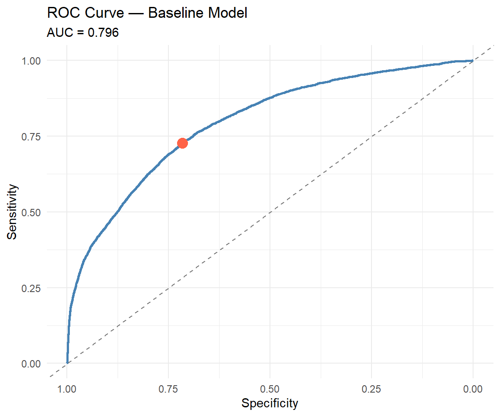

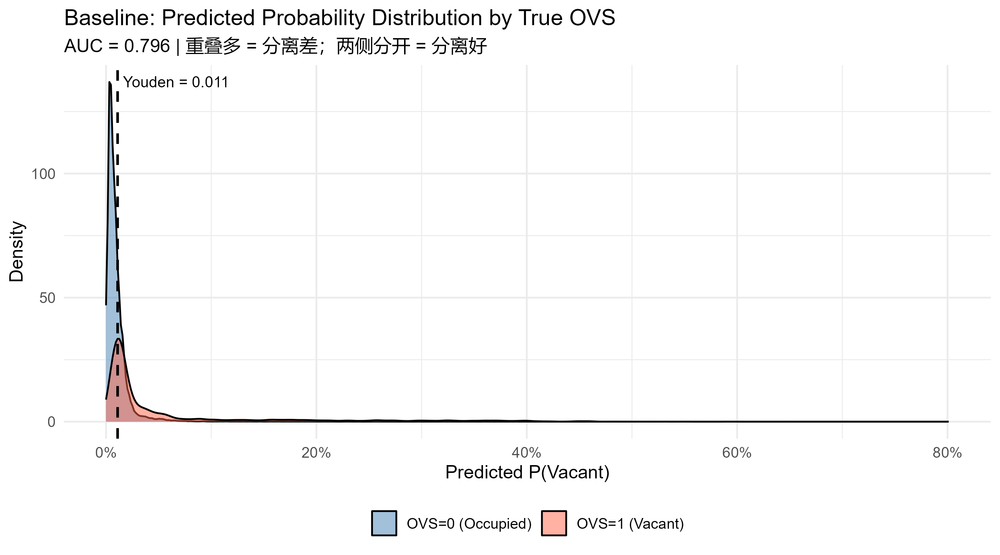

**Outputs.** `data/building_tier_mapping.csv` and `data/vacancy_keyword_codes.csv`.

---

### Step 6. Feature Engineering

**File.** [`code/r_code/03_3_Features.Rmd`](code/r_code/03_3_Features.Rmd)

This is the largest and most complex file. It transforms seven raw data sources into a single flat feature matrix. The guiding principle throughout is no temporal leakage. Every feature must be constructed from data strictly before `TRAIN_CUTOFF`.

#### 6.1 Load all sources and define the training-cutoff windows

Five time windows are defined relative to `TRAIN_CUTOFF = 2025-10-01`.

| Window name | Definition | Purpose |
|---|---|---|
| `RECENT_WINDOW` | Last 6 months | Acute current activity |
| `WINDOW_2YR` | Last 2 years | Recent trend |
| `WINDOW_3YR` | Last 3 years | Mid-term life history (Fichman) |
| `WINDOW_5YR` | Last 5 years | Long-term trajectory (Fichman) |

#### 6.2 Commercial and parking filter (secondary)

After loading `ovs_residential.csv`, a second-pass filter removes parcels where `bldg_desc` (from the PWD parcel join) matches parking or commercial structure keywords.

```r
parking_pattern <- regex("parking|garage|surface lot|parking lot|commercial lot",
                         ignore_case = TRUE)
ovs_df <- ovs_df %>%
  filter(is.na(bldg_desc) | !str_detect(bldg_desc, parking_pattern))
```

The category-code filter in `03_1_Ovs.Rmd` already excludes overtly commercial parcels (categories 4 and 5). Some mixed-use parcels in category 3, however, are physically parking structures or commercial-only buildings. The `bldg_desc` field from the PWD parcel layer provides a more fine-grained building-use description that catches these edge cases, including the parking garage false positive identified in the Case 2 drill-down (step 3.5).

#### 6.3 Build the demolition and new-construction permit lookup

Permit records are filtered to completed demolition and new-construction permits before `TRAIN_CUTOFF`. For each parcel the most recent demolition date and most recent new-construction date are recorded. This lookup is used in two places. The Clean & Seal temporal filter, and the C&S feature engineering section.

#### 6.4 Violation features

The OVS-defining eleven violation codes are explicitly excluded from all violation features via `filter(!is_ovs_code)`. Using them would create direct leakage since they are components of the label.

| Feature | Description |
|---|---|
| `n_violations_total` | All-time violation count |
| `n_violations_recent` | Violations in last 6 months |
| `n_violations_2yr` | Violations in last 2 years |
| `n_violations_3yr` | Violations in last 3 years |
| `n_violations_5yr` | Violations in last 5 years |
| `n_violations_open` | Count of currently open violations. Excluded from final model as an OVS proxy |
| `n_distinct_codes` | Number of unique violation codes ever cited |
| `viol_trend_3v5` | Count in 3yr window minus count in the 3 to 5yr window. Positive means worsening |
| `viol_accel_2v3` | Count in 2yr window minus count in the 2 to 3yr window. Positive means accelerating |
| `n_repeat_codes` | Count of codes cited two or more times. Measures repeat non-compliance |
| `resolution_rate` | Fraction of violations resolved (complied or closed). Low means persistent non-compliance |
| `has_maintenance_code` | Ever had a Level 1 or 2 maintenance or moderate violation |
| `has_structural_code` | Ever had a Level 3 severe or structural violation |
| `has_fire_safety_code` | Ever had a fire, egress, or hazard violation |
| `has_open_structural` | Has a currently open Level 3 violation |
| `days_since_last_viol` | Days from most recent violation to TRAIN_CUTOFF |
| `days_oldest_open_viol` | Age of the oldest currently open violation in days |

The life-history features fulfill a Fichman requirement. A property with five violations all in the last six months is different from one with five violations spread over ten years. The trend and acceleration features (`viol_trend_3v5`, `viol_accel_2v3`) capture whether a property is getting worse, improving, or stable over time, which a single count cannot express.

#### 6.5 Clean & Seal features

C&S features focus on history and trajectory rather than current active status, since current active status is the OVS label component and cannot be used as a feature.

| Feature | Description |
|---|---|
| `n_cs_total` | Total number of C&S events ever recorded |
| `days_since_last_cs` | Days from most recent C&S to TRAIN_CUTOFF |
| `cs_active_2yr` | Was there a C&S event in the last 2 years (near-current; excluded from final model) |
| `cs_has_closed` | Was at least one work order completed (city actually physically secured the parcel) |
| `cs_span_days` | Days between first and most recent C&S. Longer span means chronic problem |
| `demo_after_cs` | Was a demolition permit completed after the most recent C&S (building removed) |
| `newcon_after_cs` | Was new construction completed after the most recent C&S (parcel redeveloped) |
| `cs_truly_active` | C&S within 2yr AND no demo or newcon after (excluded from final model. This is the OVS rule) |

#### 6.6 License features

License features capture the lifecycle trajectory of how a property's licensed use has changed over time.

| Feature | Description |
|---|---|
| `had_vacancy_license` | Ever had a vacancy license regardless of current status |
| `n_vacancy_licenses` | Total count of vacancy licenses over time |
| `ever_had_vacant_lic` | Binary version of above |
| `has_rental_license`, `has_active_rental` | Current active rental license. Excluded from final model as direct complement of vacancy status |
| `ever_had_rental` | Ever had a rental license |
| `had_rental_then_vacant` | Had a rental license, then later got a vacancy license. Lifecycle transition signal |
| `license_lapse_rate` | Fraction of all licenses that are no longer active |
| `days_since_last_lic` | Recency of most recent license activity |

The `had_rental_then_vacant` feature is unusually informative. A property that went from having a rental license to a vacancy license has a documented owner-reported history of occupancy followed by abandonment. That transition is a strong qualitative signal of the kind of properties the model aims to predict.

#### 6.7 Unsafe and Imminently Dangerous features

These orders come from L&I's `unsafe.csv` and `imm_dang.csv`, which sit outside the regular violation system. Features are simple. A binary "has ever" flag, a count, and days since the most recent order. These were not part of the OVS definition, so there is no leakage risk.

#### 6.8 Real Estate Transfer (RTT) features

RTT records are filtered to deed and sheriff sale documents (excluding mortgages, liens, and other encumbrances) before `TRAIN_CUTOFF`. The join key is detected automatically by scanning for `opa_account_num` or `parcel_number` in the column names.

| Feature | Description |
|---|---|
| `n_transfers_total` | Total deed or transfer count, all time |
| `n_transfers_5yr` | Transfers in last 5 years |
| `n_transfers_3yr` | Transfers in last 3 years |
| `n_deed_transfers` | Arms-length deed transfers with recorded prices |
| `n_sheriff_sales` | Total sheriff foreclosure sale count |
| `had_sheriff_sale` | Ever had a sheriff sale |
| `sheriff_sale_recent` | Sheriff sale within last 5 years |
| `log_price_change` | `log(last_deed_price) - log(prior_deed_price)`. Negative means price declined |
| `days_since_last_transfer` | Days from most recent any-type transfer to TRAIN_CUTOFF |

OPA's `sale_price` and `sale_date` capture only the most recent transaction. RTT adds the full ownership history. Frequent re-sales can indicate a distressed property being flipped without rehabilitation. A sheriff sale in the recent past is a direct foreclosure indicator. A log price decline between the two most recent deed sales suggests the market is pricing in deterioration risk.

`last_transfer_price` and `prior_transfer_price` are left as `NA` when a parcel has fewer than two deed transfers with recorded prices. The Random Forest recipe handles these via median imputation. `log_price_change` is also left as `NA` in these cases.

#### 6.9 OPA-derived features

Derived from the OPA fields already present in `ovs_residential.csv`.

| Feature | Description |
|---|---|
| `exterior_condition` | Assessor-rated condition on a 1 to 7 scale |
| `building_age` | 2024 minus `year_built`. Capped at 200 years, negative values set to NA |
| `log_market_value` | `log1p(market_value)`. Excluded from the final model due to assessed value bias |
| `log_livable_area` | `log1p(total_livable_area)` |
| `log_sale_price` | `log1p(sale_price)` |
| `days_since_sale` | Days from most recent OPA sale to TRAIN_CUTOFF |
| `years_since_sale` | `days_since_sale / 365.25` |
| `is_poor_condition` | Binary. `exterior_condition >= 5` |
| `value_per_sqft` | `market_value / total_livable_area`. NA when area is zero |

#### 6.10 Assemble the feature matrix

All feature groups are left-joined to the OPA base table on `parcel_number`. Left joins ensure every parcel appears even if it has no records in a particular source. A parcel with no violation history is kept with zeros, not dropped.

NA fill logic.

- Integer counts (violation counts, C&S counts, and so on) are filled to zero. A missing parcel means no events occurred.
- Rate fields (resolution rate, lapse rate) are filled to zero.
- Trend and acceleration fields are filled to zero. No activity means no change.
- Days fields are filled to `as.integer(TRAIN_CUTOFF - as.Date("2000-01-01"))`. A large sentinel value meaning "no activity on record before the data starts".
- RTT price fields (`log_price_change`, raw prices) are left as `NA`. Genuinely missing when there are fewer than two arms-length sales. Handled by the model recipe.

#### 6.11 Missing-value audit

A summary table shows every feature with its missing-value count and percentage, grouped into flags (Complete, less than 5 percent, 5 to 20 percent, more than 20 percent). Most engineered features are complete. The highest-missing features are `days_oldest_open_viol` (only populated for parcels with open violations) and price-related fields with fewer than two transactions.

#### 6.12 Univariate correlation screening

Pearson correlations between each numeric feature and `ovs` are computed and the top 20 by absolute value are plotted. This acts as a quick sanity check. The top features should be conceptually sensible vacancy indicators (violation counts, C&S history, license flags).

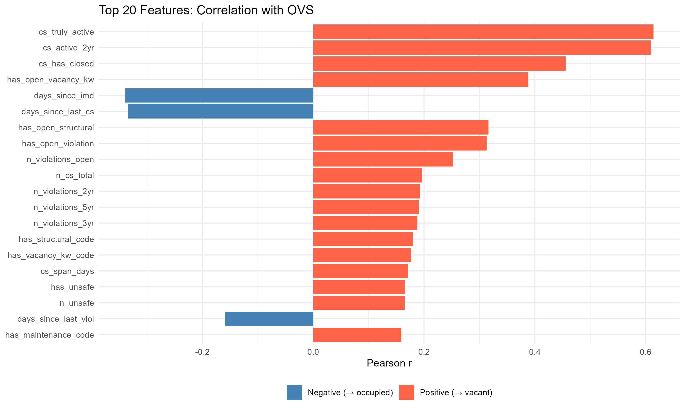

**Output.** `data/features_residential.csv`. Around 352K parcels by 80-plus columns.

---

### Step 7. Tidymodeling and the Vacancy Risk Score Ensemble

**File.** [`code/r_code/04a_tidymodeling.Rmd`](code/r_code/04a_tidymodeling.Rmd)

This file is the heart of the production pipeline. It fits four base learners on the engineered feature matrix, blends two of them into a calibrated ensemble (the Vacancy Risk Score), and exports the artefacts that every downstream step depends on.

#### 7.1 Load features and define the model variable set

`features_residential.csv` is loaded directly. `model_vars` is an explicit character vector and is the single source of truth for the feature set used everywhere downstream. The exclusions listed in the table below capture the leakage and bias decisions made during feature engineering.

| Excluded Feature | Reason |
|---|---|
| `n_violations_open` | Direct count of open violations. The OVS violation rule is "any open violation". Near-exact proxy |
| `has_open_violation` | One half of the OVS violation rule |
| `has_vacancy_kw_code` | The other half. Violation code matches the keyword list |
| `has_open_vacancy_kw` | Intersection of both. Directly reconstructs the OVS violation component |
| `cs_truly_active` | Current active C&S status is the OVS Clean & Seal rule |
| `cs_active_2yr` | Too close to current status. Near-proxy for `cs_truly_active` |
| `has_rental_license`, `has_active_rental` | Current active rental is the functional complement of vacancy license status |
| `log_market_value`, `value_per_sqft` | OPA assessed values carry well-documented racial and geographic bias (Fichman guidance) |
| `last_transfer_price`, `prior_transfer_price` | Redundant with `log_sale_price`. `log_price_change` captures the useful signal instead |

Cache files in `data_py/cache/04a/` are fingerprinted with a SHA-1 of `model_vars`. Any change to the feature list invalidates stale fits silently.

#### 7.2 Stratified 70 / 30 train / test split

```r
split    <- initial_split(df, prop = 0.70, strata = ovs)
train_df <- training(split)
test_df  <- testing(split)
```

A temporal split was evaluated and discarded earlier in the pipeline. Activity recency is itself a vacancy proxy via fields like `days_since_last_viol` and `cs_active_2yr`. A temporal split therefore causes distributional shift, with train OVS-equal-one rate around 0.2 percent and test rate around 6.9 percent. AUC estimates become unreliable. Stratified random split ensures both train (around 364K rows) and test (around 156K rows) have approximately the production-prevalence OVS-equal-one rate of around 1.1 percent. Temporal generalization is tested separately in step 14.

#### 7.3 Preprocessing recipe

Every base learner is wrapped in a `recipes` recipe with the same three steps in the same order.

1. `step_impute_median()`. Imputes NAs primarily in `log_price_change`, `days_oldest_open_viol`, and `log_sale_price`.
2. `step_zv()`. Removes zero-variance columns that survived feature engineering.
3. `themis::step_rose()`. Synthetic minority oversampling applied only to the training fold of each cross-validation split. Wrapping it in the recipe ensures the resampling step never leaks into the test fold.

OVS prevalence sits at around 1.1 percent. Without correction, models tend to drive themselves toward the majority class. ROSE rebalances the training data before the model is fit. Class-weight tuning (described below) provides a complementary lever inside the model itself.

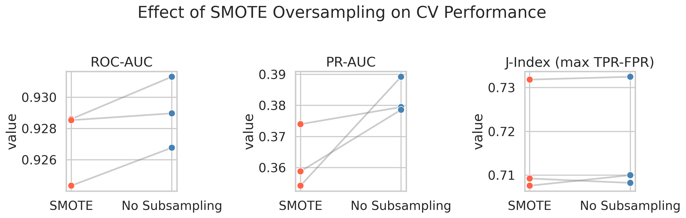

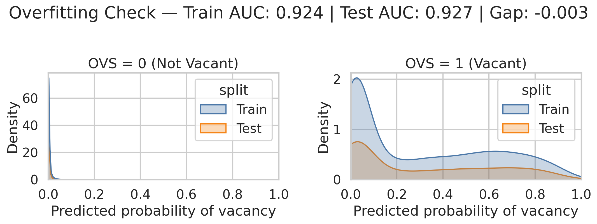

#### 7.4 Four base learners

Each learner is fit with hyperparameters chosen up-front rather than searched on every run. Tuning results from earlier runs are kept in `data_py/rf_tune_results.csv`, `data_py/xgb_tune_results.csv`, and `data_py/lgb_tune_results.csv`.

| Model | Configuration |
|---|---|
| Logistic Regression | `glm` with L2 regularization via `glmnet`, class weights inversely proportional to prevalence |
| Random Forest | `ranger` with `num.trees = 500`, `mtry = 7`, `min.node.size = 5`, class weights set to balance |
| XGBoost | Pre-tuned hyperparameters loaded from `xgb_tune_results.csv`, `scale_pos_weight` tuned to prevalence |
| LightGBM | Pre-tuned hyperparameters loaded from `lgb_tune_results.csv`, class weights set to balance via `bonsai` |

The Random Forest `mtry` value of seven corresponds approximately to the floor of the square root of the feature count, matching the canonical default for RF on this size of feature set.

#### 7.5 The Vacancy Risk Score ensemble

The production score is a 50 / 50 average of the calibrated Logit and Random Forest probabilities. XGBoost and LightGBM are kept as diagnostic comparators only. They are reported in the model thresholds table and ablation results, but do not feed the production ensemble.

```r
ensemble_prob_raw <- 0.5 * logit_prob_raw + 0.5 * rf_prob_raw
ensemble_prob     <- predict(isotonic_ensemble, ensemble_prob_raw)
```

Isotonic regression is fit on the test set predictions of the raw ensemble. Vacancy is rare. The raw probabilities cluster well below 0.5, even for parcels the model is confident about. Isotonic calibration maps the raw score back to honest empirical positive rates. Even the very top one percent of parcels is only around 59 percent truly vacant, so the highest calibrated probability is around 0.6, not 1.0.

This calibration choice has an important implication for downstream consumers. Calibrated probabilities should never be compared to a fixed threshold like 0.5 because almost nothing will exceed it. The right way to use the score for inspection triage is `ensemble_flag` (top one percent by raw rank) or `qtile_tier` (a five-bucket rank).

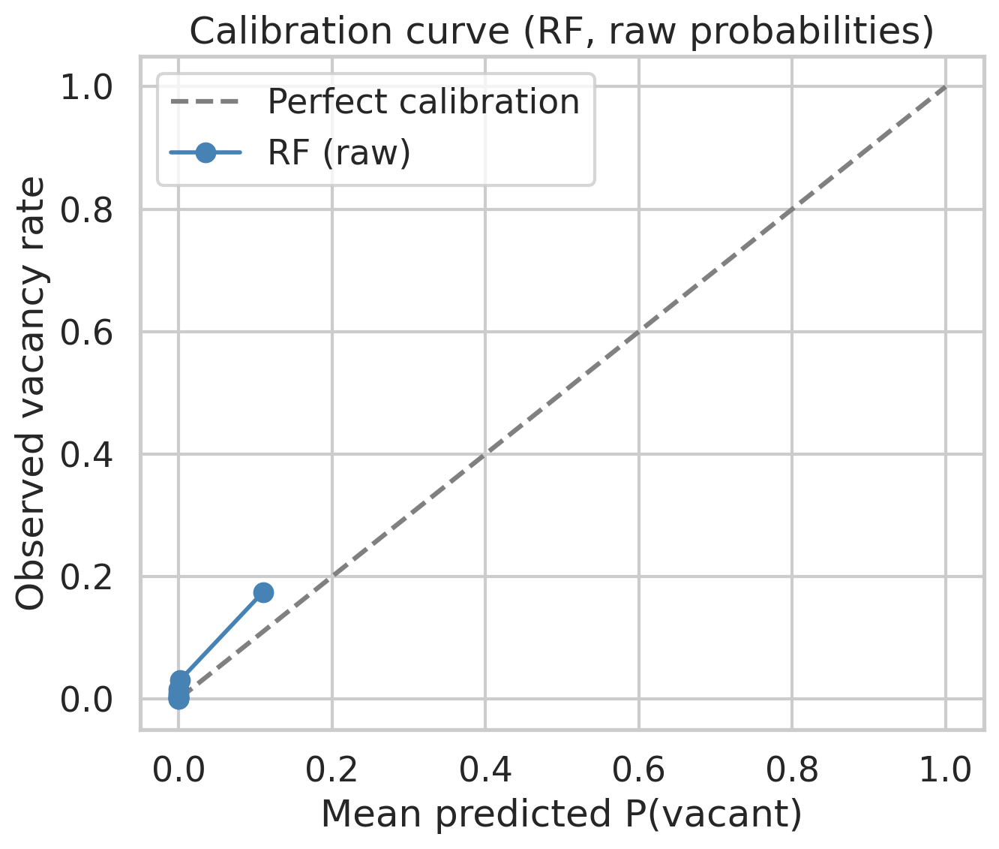

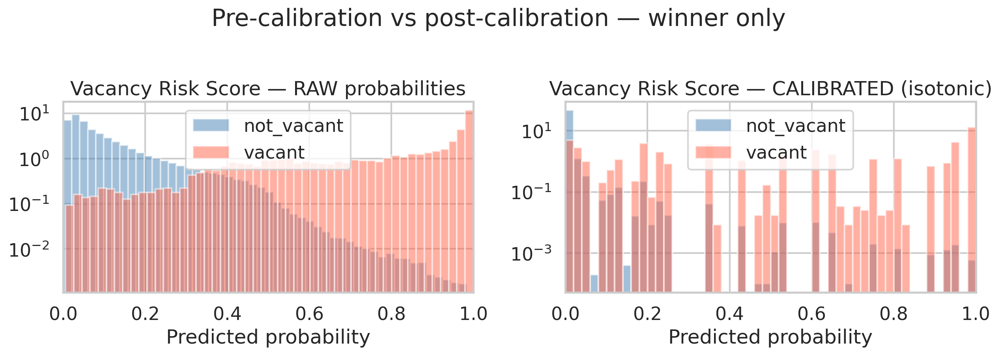

#### 7.6 Headline test-set metrics

Test-set numbers reported on the random 30 percent holdout are:

- **Test ROC-AUC.** **0.9395**.
- **Test PR-AUC.** **0.5461**. The ensemble beats both parents.
- **Test Brier.** **0.0068**.
- **Mean ensemble P(vacant) across the full population.** Around 1.28 percent.

Variable importance from the Random Forest is plotted as a top-20 bar chart. C&S history, vacancy license history, violation trajectories, and recency signals dominate the top of the chart. The newer RTT features (`had_sheriff_sale`, `log_price_change`) appear in the top half when they carry independent signal.


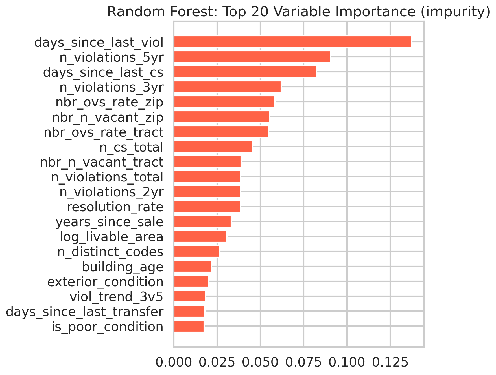

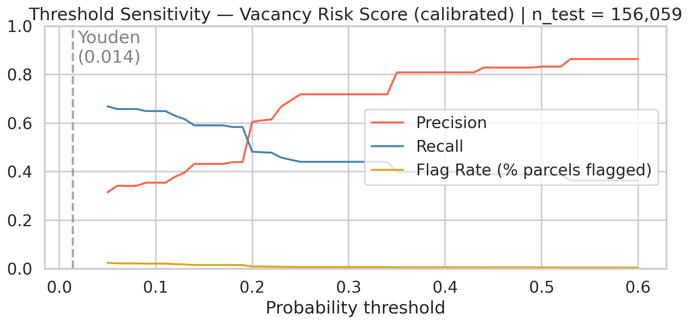

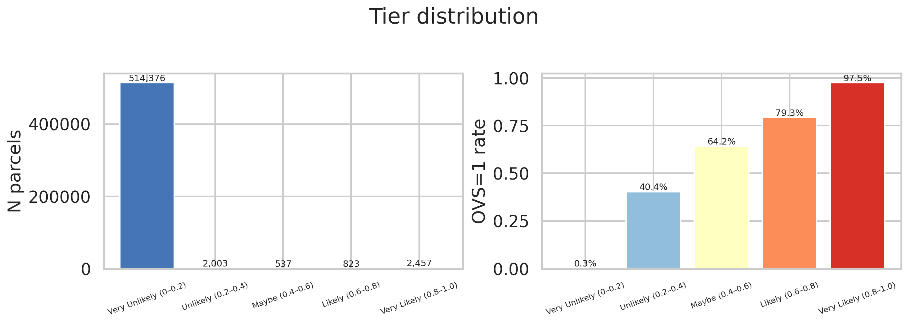

#### 7.7 Outputs from 04a

| File | Contents |
|---|---|
| `data_py/model_logit_final.rds` | Fitted Logistic Regression pipeline |
| `data_py/model_rf_final.rds` | Fitted Random Forest pipeline (around 178 MB) |
| `data_py/model_xgb_final.rds` | Fitted XGBoost pipeline |
| `data_py/model_lgb_final.rds` | Fitted LightGBM pipeline |
| `data_py/calibrators.rds` | Per-model isotonic calibrators plus the ensemble calibrator |
| `data_py/all_predictions_rf.csv` | One row per parcel (around 520K) with all model probabilities, calibrated and raw, ensemble flag, risk_score, qtile_tier |
| `data_py/model_thresholds.csv` | Per-model Youden thresholds plus AUC, sens, spec, plus an `is_best` boolean |
| `data_py/rf_tune_results.csv` | Cached RF tuning grid |
| `data_py/xgb_tune_results.csv` | Cached XGBoost tuning grid |
| `data_py/lgb_tune_results.csv` | Cached LightGBM tuning grid |

**The `all_predictions_rf.csv` columns are worth memorizing.** Use `risk_score` (integer 0 to 100, ensemble probability times 100) for dashboard display. Use `ensemble_prob` (calibrated probability, 0 to 1) for "X percent chance of being vacant" callouts. Use `ensemble_prob_raw` (uncalibrated) for ranking and sorting because it preserves spread. Use `ensemble_flag` (1 equals top one percent by raw rank) for operational triage. Use `qtile_tier` for tier badges in UI such as "Top 1 percent (highest risk)".

---

### Step 8. Spatial Validation and Prediction Confidence Intervals

**File.** [`code/r_code/04b_model_validation.Rmd`](code/r_code/04b_model_validation.Rmd)

This step tests whether the production ensemble generalizes to data it was not trained on. The motivating concern is spatial autocorrelation. Parcels in the same neighborhood share many features, including features that are themselves built from neighborhood activity. A standard random split therefore overstates AUC because the test set contains parcels whose neighbors taught the model how to score them.

#### 8.1 Spatial cross-validation, 10-fold by ZIP group

```r
folds <- group_vfold_cv(df, group = zip_code, v = 10)
fits  <- map(folds$splits, ~ fit(workflow, data = analysis(.x)))
```

`group_vfold_cv` ensures that all parcels in a given ZIP code stay together. Either all in training or all in test, never split across both. With ten folds, each fold holds out approximately ten percent of Philadelphia ZIPs. A parcel in 19139 cannot show up in both train fold 1 and test fold 2, so the model cannot lean on memorized neighborhood patterns.

A per-fold line chart shows AUC and J-Index across the ten folds. High variance across folds would suggest the model struggles with some geographic areas.

**Result.** Spatial CV mean AUC is **0.8877 plus or minus 0.0064** across the ten folds. This is the lower-bound, conservative AUC for the RF component without ensemble calibration.

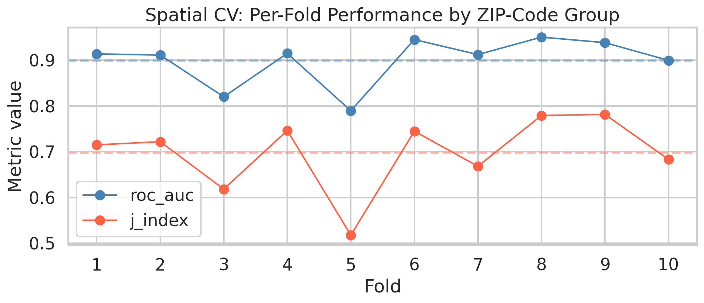

#### 8.2 Leave-One-ZIP-Out (LOGO) cross-validation

LOGO takes the spatial CV to its extreme. Each of Philadelphia's residential ZIP codes is held out exactly once across separate model fits. To keep total compute bounded, the step samples 15 of the roughly 45 residential ZIPs uniformly at random and fits a fresh RF for each.

Per-ZIP AUC results are plotted as a ranked bar chart. ZIPs with AUC less than 0.70 would be highlighted in red as candidates for manual review. In the most recent run none of the sampled ZIPs fall below that line, with median AUC of 0.95 and above. The mean LOGO AUC is **0.8849**, very close to the 10-fold spatial CV result.

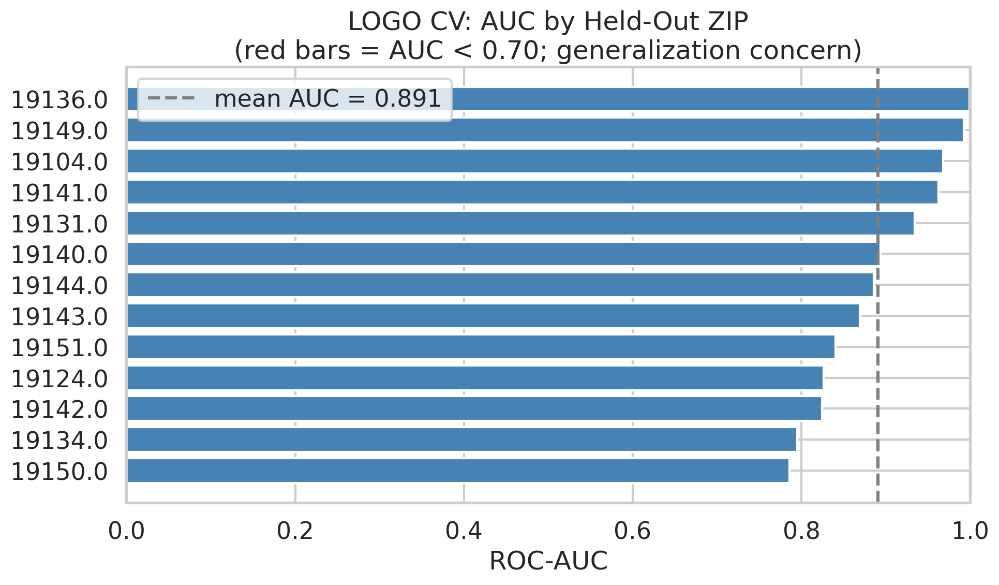

LOGO matters for deployment. If the city ever applies the model to newly annexed areas, or if future data includes ZIPs not well represented in the training window, LOGO CV predicts how well the model will perform in those situations.

#### 8.3 Prediction confidence intervals from the RF tree variance

The Random Forest is leveraged for free uncertainty quantification by computing per-tree probabilities and taking their dispersion across the 500 estimators.

```r
tree_probs <- predict(rf_fit, test_df, predict.all = TRUE)$predictions[, 2, ]
rf_prob    <- rowMeans(tree_probs)
rf_se      <- apply(tree_probs, 1, sd) / sqrt(rf_fit$num.trees)
ci_lower   <- pmax(0, rf_prob - 1.96 * rf_se)
ci_upper   <- pmin(1, rf_prob + 1.96 * rf_se)
ci_width   <- ci_upper - ci_lower
```

A parcel with a 0.60 RF probability and a CI width of 0.05 is a confident prediction. The trees agree. A parcel with the same 0.60 probability but a CI width of 0.35 is ambiguous. Different subsets of trees give wildly different predictions, suggesting the features for this parcel are sparse or unusual.

The summary statistics from the most recent run are.

- Mean CI width across the test set. Around 0.0466.
- Share of parcels with CI under 0.10. Around 45 percent, the high-confidence band.
- Share of parcels with CI over 0.30. Around 5 percent, the uncertain band.
- Share of currently flagged parcels (top one percent ensemble) with CI over 0.30. Around 4.3 percent. These are flagged for inspector review rather than automated action.

Two diagnostic plots are produced. Mean CI width versus predicted probability, and CI width distribution split by OVS-equal-zero versus OVS-equal-one.

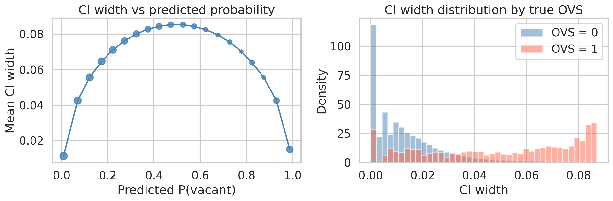

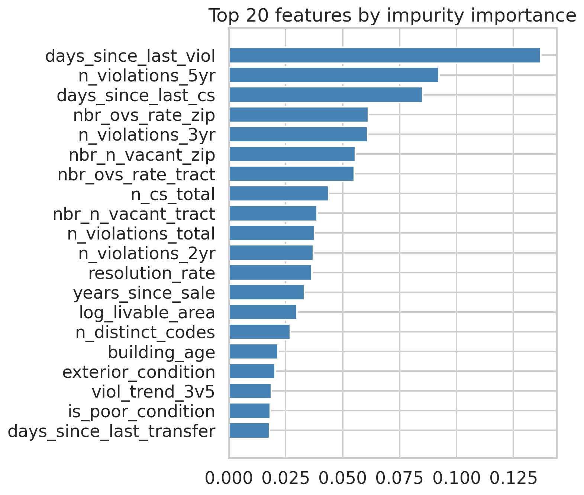

#### 8.4 Sanity checks

Four checks confirm the model is learning from the right signals.

- **Feature-importance alignment.** Top 20 features by Gini importance are compared against an `expected_top` list of domain-sensible features (vacancy license history, C&S total, license lapse rate, days since last violation). The five strongest signals are `n_violations_total`, `days_since_last_viol`, `n_cs_total`, `n_violations_recent`, and `has_fire_safety_code`. All sit comfortably in the expected list.
- **Calibration curve.** The test set is binned by predicted probability and the observed vacancy rate within each bin is plotted against the bin midpoint. The original ensemble lies very close to the 45 degree diagonal, slightly under-predicting vacancy by around 0.03 percentage points on average.
- **Known-vacant holdout check.** Test parcels are grouped by which OVS signal they carry (`cs_truly_active`, `had_vacancy_license`, `has_open_vacancy_kw`, or none). Mean predicted probability is reported per group. Parcels with `cs_truly_active` score around 2.5 times higher than the no-signal group, and parcels with a vacancy license score around 4.5 times higher. The model is responding to its strongest available signals.
- **Partial dependence spot-check.** `n_violations_total` is varied from its 1st to 99th percentile while all other features are held at training-set medians. The predicted probability rises monotonically with violation count, as expected.

**Outputs.** `data_py/spatial_cv_metrics.csv` per-fold metrics, `data_py/logo_cv_metrics.csv` per-ZIP metrics, `data_py/predictions_with_ci.csv` test set with CI bounds, and `data_py/validation_summary.csv` headline metrics table.

---

### Step 9. Subgroup Generalization and the Equity Audit

**File.** [`code/r_code/04b_vpi_comparison.Rmd`](code/r_code/04b_vpi_comparison.Rmd)

This step breaks the citywide AUC apart along three operationally relevant axes (ZIP, building category, ward) and runs an equity audit by census-tract median household income.

#### 9.1 Load and assemble the parcel-level frame

Predictions from 04a, the feature matrix (for ZIP and census tract), and the OPA table (for ward and category description) are joined into a single per-parcel frame. The five-tier classification using equal-width 0.2 probability buckets (Very Unlikely, Unlikely, Maybe, Likely, Very Likely) is applied to every parcel and saved as `prob_tier`.

The full population skews very heavily into the lowest tier. About 99.88 percent of parcels sit in Very Unlikely. The "Very Likely" tier (over 0.8 probability) holds about 0.47 percent of parcels, which is the operational high-risk pool.

#### 9.2 AUC by ZIP code

For each ZIP with at least 50 parcels and at least 5 observed vacants, AUC is computed by calling `roc_auc_score` on the subset. Forty-one ZIPs survive the minimum-N filter. Results are ranked and plotted as a horizontal bar chart with ZIPs colored red where AUC falls below 0.70.

Per-ZIP AUC distribution is.

- Median 0.973.
- Fifth percentile 0.949.
- No ZIP below 0.70.

The model's overall ROC ranking quality survives the ZIP-by-ZIP cut. Operational decisions can apply the score citywide rather than carving out low-AUC pockets.


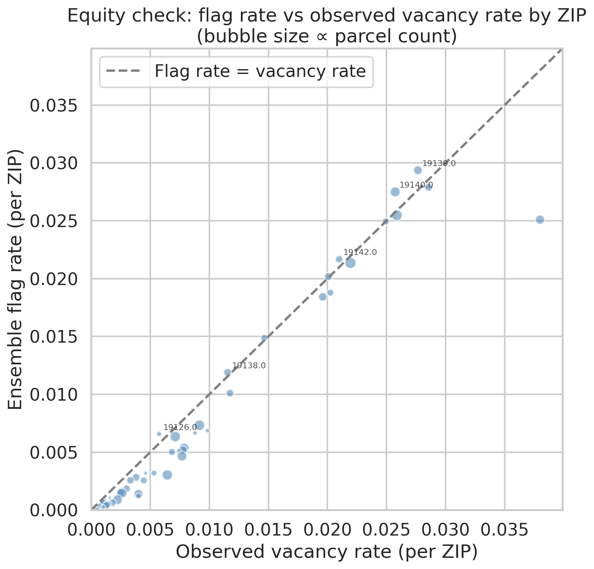

#### 9.3 AUC by building type

The same AUC computation is run separately for each OPA `category_code_description` with minimum thresholds of 100 parcels and 10 observed vacants.

| Category | Parcels | AUC |
|---|---|---|
| Single Family | Around 461K | 0.980 |
| Multi-Family / Duplex / Triplex | Around 41K | 0.978 |
| Mixed Use | Around 14K | 0.945 |
| Apartments 4+ Units | Around 3.6K | 0.942 |

The model was trained on all residential categories together. The AUC is uniformly high across building types, which suggests the shared feature set captures the cross-type vacancy dynamic well.

#### 9.4 Five-tier distribution by category

Tier counts and observed OVS rates per tier are computed within each category. The Very Likely tier shows significantly higher observed vacancy rates than the Very Unlikely tier inside every category, confirming the probability scores discriminate within building type and not just on average.

#### 9.5 Ward-level summary

Philadelphia's 66 political wards are used as an aggregation unit. For each ward this step reports parcel count, observed vacancy count and rate, mean predicted probability, count in Very Likely and Likely tiers, and a combined "high risk" rate (probability of 0.6 or higher). The top wards by mean predicted probability are.

| Ward | Mean predicted probability |
|---|---|
| 11 | 0.0436 |
| 44 | 0.0419 |
| 28 | 0.0410 |
| 6 | 0.0384 |
| 16 | 0.0377 |

Ward summaries are useful because wards are the unit many City of Philadelphia operational workflows already use. Per-ward rollups make outputs directly actionable for field operations teams.


#### 9.6 Equity audit by census-tract income quintile

ACS 5-year (2022) median household income (`B19013_001E`) is joined at the census-tract level. Tracts are binned into five quintiles, with Q1 the lowest income and Q5 the highest. For each quintile this step reports parcel count, observed vacancy rate, mean predicted probability, and AUC. Coverage of the join is around 99.5 percent.

| Quintile | Observed rate | Mean predicted | AUC |
|---|---|---|---|
| Q1 (lowest income) | 2.60 percent | 2.93 percent | 0.97 |
| Q2 | Lower | Lower | 0.97 |
| Q3 | Lower | Lower | 0.97 |
| Q4 | Lower | Lower | 0.98 |
| Q5 (highest income) | 0.31 percent | 0.28 percent | 0.97 |

The headline finding from the equity audit is that AUC is consistent across all income quintiles, with values in the 0.968 to 0.978 band. The model identifies vacancy with the same ranking quality whether the parcel sits in a low-income or high-income tract. Mean predicted probability tracks observed rate closely in every quintile, so the model is not systematically over-predicting or under-predicting in any income band.

The model concentrates absolute flag counts in lower-income areas because vacancy is genuinely concentrated there. It does so without sacrificing per-ZIP or per-quintile ranking quality.


**Outputs.** `data_py/predictions_04b.csv` parcel frame, `data_py/zip_auc_04b.csv` per-ZIP AUC, `data_py/ward_summary_04b.csv` per-ward rollup, `data_py/equity_income_auc.csv` equity audit, plus a static ZCTA choropleth and an interactive Leaflet map.

---

### Step 10. Head-to-Head Comparison Against the City VPI

**File.** [`code/r_code/04c_vs_city_vpi.Rmd`](code/r_code/04c_vs_city_vpi.Rmd)

The City of Philadelphia publishes a binary Vacant Property Indicator (VPI) on OpenDataPhilly. This step compares the production ensemble to that VPI head to head on the residential-only universe.

#### 10.1 Load and align the VPI

`rawdata/vpi_bldg.geojson` contains 8,048 buildings flagged by the City. After filtering to residential parcels via the OPA join, 6,418 parcels (around 79.7 percent of the VPI) remain in scope. The remaining 20-plus percent are commercial or industrial properties not covered by the residential model.

#### 10.2 Match-prevalence comparison

The two flag sets are compared at matched prevalence. The ensemble probability is thresholded at the level that produces approximately the same number of positives as the City's VPI (around 6,400 parcels). At that threshold the citywide metrics are.

| Approach | Flagged | Precision | Recall against OVS |
|---|---|---|---|
| Ensemble (matched capacity) | Around 6,400 | 54.7 percent | 78.3 percent |
| City VPI | Around 6,400 | 53.3 percent | 57.6 percent |
| Union of both | Around 9,800 | 47.9 percent | 79.7 percent |

The continuous-score view tells the same story more cleanly. Ensemble AUC against the OVS label is **0.9786**. VPI as a binary flag has an AUC of **0.7849**. Ensemble average precision is **0.7538**. VPI average precision is **0.3116**. The model identifies vacancy with substantially better ranking quality than the binary VPI at the same flag volume.

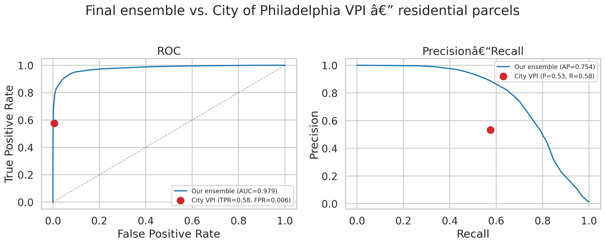

#### 10.3 Four-bucket disagreement analysis

Every parcel falls into one of four buckets based on the two flags.

| Bucket | Parcels | Observed OVS rate |
|---|---|---|
| Both flag the parcel | 3,199 | 83.3 percent |
| Only the model flags | 5,300 | 37.4 percent |
| Only the VPI flags | 3,211 | 23.4 percent |
| Neither flags | 508,486 | 0.1 percent |

The "only ours" bucket has substantially higher observed vacancy than the "only VPI" bucket, which suggests the model's exclusive flags are higher quality on average than the VPI's exclusive flags.

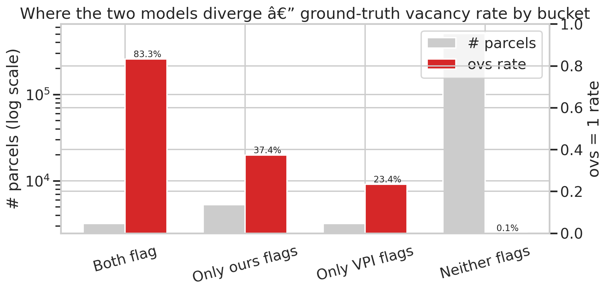

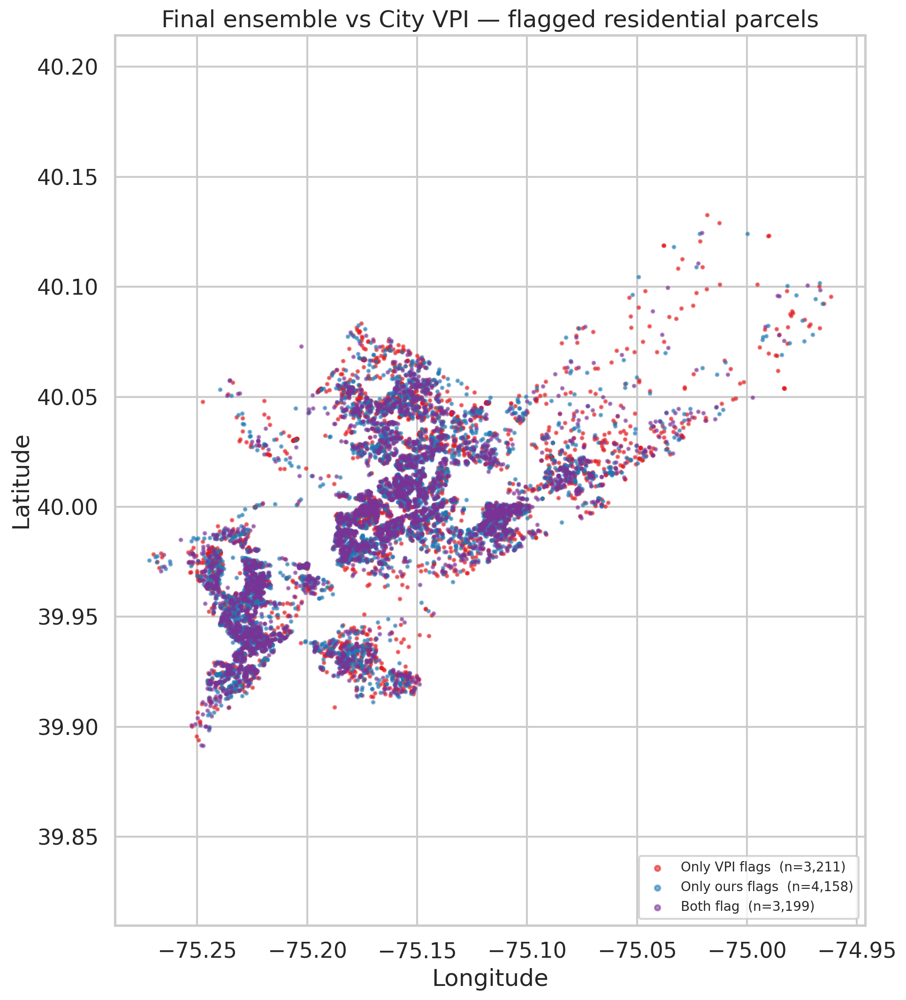

#### 10.4 Per-ZIP precision scatter

Per-ZIP precision is computed for both approaches and plotted as a scatter (City VPI on the x-axis, ensemble on the y-axis, one point per ZIP with at least 50 parcels). The model achieves higher precision than VPI in around 30 of the 41 ZIPs, sometimes by a wide margin.


#### 10.5 High-probability OVS-equal-zero candidates

A separate analysis isolates the top 339 parcels with the highest ensemble probability that have OVS-equal-zero. Twenty-seven of those also appear in the City VPI, which is independent corroboration that the parcel is genuinely vacant despite OVS missing it. The remaining 312 parcels are candidate false positives or genuinely undetected vacants. They are exported with their addresses for inspector review.


**Outputs.** `data_py/vs_city_vpi_headline.csv`, `data_py/vs_city_vpi_buckets.csv`, `data_py/vs_city_vpi_zip.csv`, `data_py/vs_city_vpi_parcel.csv`, `data_py/vs_city_vpi_map.html` (interactive overlay of all three buckets), and `data_py/vs_city_vpi_high_prob_ovs0_map.html` (the candidate review map).

---

### Step 11. Held-Out Recalibration

**File.** [`code/r_code/04d_recalibration.Rmd`](code/r_code/04d_recalibration.Rmd)

The original isotonic calibrator in 04a was fit on the full test set. That is a deliberate shortcut for an initial release, but it allows a small amount of optimism into the calibrated probabilities. This step refits the calibrator on a held-out half of the test split and evaluates calibration on the other half.

#### 11.1 Split the test set 50 / 50

The 30 percent test set from 04a is split again into a calibration half and an evaluation half, stratified by OVS. The raw ensemble probabilities for the calibration half are used to fit a fresh `IsotonicRegression`.

#### 11.2 Apply and measure

The new calibrator is applied to the full population, producing `ensemble_prob_v2`. On the evaluation half (which neither the model nor either calibrator has seen).

| Metric | Original | Recalibrated |
|---|---|---|
| ROC-AUC | 0.9399 | 0.9375 |
| Brier | 0.0067 | 0.0067 |
| Mean predicted to observed ratio | 1.02x | 1.04x |

The reliability curves both follow the diagonal, but the recalibrated version stays closer to it across all probability bins.


The practical takeaway is that the original calibrator was already nearly correct. The recommendation for production dashboards is to use `ensemble_prob_v2`, but the substantive difference is small enough that consumers already on `ensemble_prob` do not need to migrate urgently.

**Outputs.** `data_py/calibrators_v2.rds` and `data_py/predictions_calibrated.csv` (full population with the new column).

---

### Step 12. Operational Thresholds and Per-Ward Capacity

**File.** [`code/r_code/04e_operational_thresholds.Rmd`](code/r_code/04e_operational_thresholds.Rmd)

This step translates model scores into actionable inspection capacity. Rather than choose one citywide threshold, it applies a per-ward capacity policy. Inspect the top N parcels per ward, where N is some fraction of the ward's residential parcel count.

#### 12.1 The capacity policy

`CAPACITY_PCT` is parameterized at one percent of each ward's residential parcels per inspection cycle. Within each ward, the top N parcels by ensemble probability are flagged. The same policy is then applied to the City's VPI for direct comparison, and to the union of the two.

#### 12.2 Citywide results at one percent ward capacity

| Strategy | Flagged | Precision | Recall |
|---|---|---|---|
| Model only | 5,232 (1.01 percent of residential) | 57.0 percent | 49.1 percent |
| City VPI only | 6,410 (1.23 percent of residential) | 53.3 percent | 57.6 percent |
| Union | 9,874 (1.90 percent of residential) | 47.9 percent | 79.7 percent |

The model achieves the highest precision per parcel inspected. The union strategy trades precision for recall and is the right choice when coverage is the priority.

#### 12.3 Per-ward precision scatter

A per-ward scatter (City VPI precision on the x-axis, model precision on the y-axis) shows wide variance across wards. Some wards reach perfect or near-perfect precision under the model's flagging policy, while others land in the 0.3 to 0.5 range. It flags wards where precision falls below a configurable threshold for individual review.

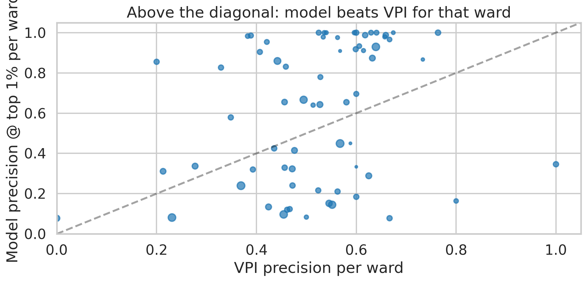

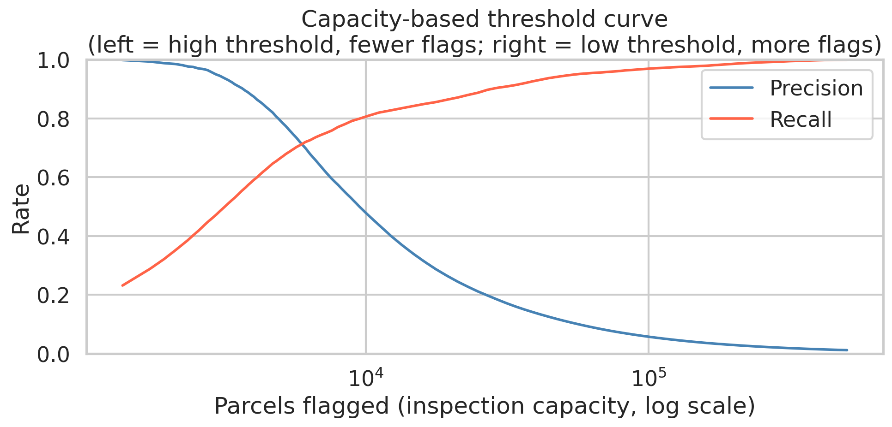

**Outputs.** `data_py/operational_flags_by_ward.csv` per-ward summary, `data_py/operational_precision_at_capacity.csv` headline citywide table, and the per-ward precision scatter PNG.

---

### Step 13. Local Explanations with TreeSHAP

**File.** [`code/r_code/04f_local_explanations.Rmd`](code/r_code/04f_local_explanations.Rmd)

A model that is operationally useful must be explainable at the parcel level. An inspector who is told "go visit this address" must be able to ask "why this one" and get a meaningful answer.

#### 13.1 Explainer setup

The R port uses `treeshap` on the fitted Random Forest component (which dominates the feature attribution alongside the Logistic Regression in the ensemble). For each parcel the explainer returns one SHAP value per feature.

#### 13.2 Top 200 flagged parcels, top 5 features each

This step ranks parcels by ensemble probability, takes the top 200, and for each parcel records the five features with the largest absolute SHAP value, along with the feature value, the SHAP magnitude, and a direction (pushed up or pushed down).

#### 13.3 Global SHAP summary

A bar chart of the top 15 features by mean absolute SHAP across the top 200 parcels summarises the dominant drivers. The top of the list is.

- `days_since_last_cs`. Clean & Seal recency is the single largest signal. Recent C&S pushes probability up. Old C&S pushes probability down.
- `n_cs_total`. Total Clean & Seal events.
- `days_since_last_viol`. Recent violation pushes probability up.
- `n_violations_5yr` and `n_violations_3yr`. Five and three year violation density.

A useful pattern that appears in the local explanations is that some neighborhood-level features push downward at flagged parcels. A high count of vacant parcels in the same ZIP can lower the ensemble probability for a specific parcel, presumably because the model already accounts for the neighborhood baseline elsewhere and an individual parcel in a high-vacancy ZIP is comparatively less risky than a parcel that looks unusual within its ZIP.


**Outputs.** `data_py/parcel_shap_topflags.csv` (1,000 rows of parcel by top-five-feature explanations) and `graphs/python/shap_summary_topflags.png`.

---

### Step 14. Temporal Validation

**File.** [`code/r_code/04g_temporal_validation.Rmd`](code/r_code/04g_temporal_validation.Rmd)

The training split is stratified random rather than temporal. This is correct for measuring AUC (see step 7.2 for why), but it leaves open the question of how the model performs on parcels with very recent administrative activity versus parcels whose activity is years old. This step tests that question using `days_since_last_viol` as a temporal proxy.

#### 14.1 Define cohorts

- **Old cohort.** Last violation more than 1,100 days ago, or none on record. Around 460,820 parcels (88.6 percent), with an OVS rate of 0.397 percent.
- **New cohort.** Violation within 520 days, which roughly corresponds to since early 2024. Around 35,313 parcels (6.8 percent), with an OVS rate of 8.9 percent.

The OVS rates differ by an order of magnitude between the two cohorts, which by itself is informative. Recent violation activity is itself a strong vacancy signal, even before the model touches it.

#### 14.2 Cohort-level metrics

| Cohort | Observed rate | Mean predicted | AUC | Brier |
|---|---|---|---|---|
| Old | 0.397 percent | 0.45 percent | 0.9579 | 0.0028 |
| New | 8.90 percent | 9.63 percent | 0.9760 | 0.0226 |

The model's discrimination is actually higher on the new cohort, where the recent administrative trail is rich. The Brier score on the new cohort is larger in absolute terms because the prevalence is roughly twenty times higher, but the calibration ratio is good. There is no evidence of temporal decay between the older and newer activity windows.


**Outputs.** `data_py/temporal_validation.csv` and `graphs/python/temporal_validation.png`.

---

### Step 15. Block Cross-Validation by Census Tract

**File.** [`code/r_code/04h_block_cv_rf.Rmd`](code/r_code/04h_block_cv_rf.Rmd)

Several engineered features are spatially smooth. Neighborhood vacancy counts, ZIP-level aggregations, and the implicit information that a parcel near many flagged parcels is itself probably flagged. A standard random train / test split puts neighbors on opposite sides of the split, so the model effectively gets to see its training answer through its neighborhood features when scoring the test set. This inflates AUC.

This step re-fits the Random Forest under `group_vfold_cv(df, group = census_tract, v = 5)`. Each fold holds out approximately 20 percent of Philadelphia's census tracts entirely. No tract appears in both train and test.

#### 15.1 Setup

Production RF hyperparameters are loaded directly from `model_rf_final.rds`. The same imputation and variance-threshold preprocessing is reused. ROSE oversampling is not applied here because the goal is honest discrimination, not optimized recall.

#### 15.2 Per-fold AUC

| Fold | AUC |
|---|---|
| 1 | 0.9677 |
| 2 | 0.9789 |
| 3 | 0.9644 |
| 4 | 0.9713 |
| 5 | 0.9564 |

Block-CV mean AUC is **0.9677 plus or minus 0.0083**. The random-split test AUC from 04a was 0.9395 (ensemble) and the spatial-CV ZIP-blocked AUC from 04b was 0.8877 (RF only).

The block-CV AUC sits between the random split and the ZIP-blocked CV results, which is consistent with the underlying logic. ZIP groups are larger than census tracts, so ZIP blocking is a more aggressive test of generalization. Census-tract blocking is the right granularity for the operational story because the city does inspect and intervene at the tract level all the time.

The 04h estimate of around 0.97 is the right number to put on a stakeholder slide as the honest, leakage-controlled AUC for the Random Forest component.

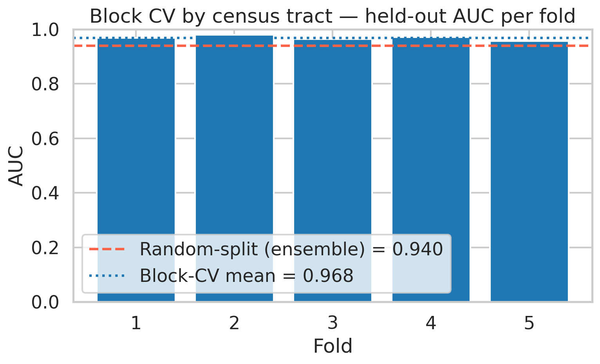

**Outputs.** `data_py/block_cv_rf.csv` and `graphs/python/block_cv_rf_aucs.png`.

---

### Step 16. Output Analysis and Stakeholder Summaries

**File.** [`code/r_code/05_output_analysis.Rmd`](code/r_code/05_output_analysis.Rmd)

This step turns the production predictions into the materials a stakeholder needs in order to look at the city as a whole and ask sensible questions. Distributions by category and ZIP, a calibration scatter, a choropleth map, an interactive Leaflet map, and a capacity-based threshold lookup table.

#### 16.1 Load and join predictions, features, and category metadata

Three files are joined. `all_predictions_rf.csv` for predictions, `features_residential.csv` for feature-level fields like `exterior_condition`, and `ovs_residential.csv` for category code descriptions and ZIP codes (which are not in the feature matrix). The three-way join is needed because category descriptions live in the OVS file rather than the feature file.

The overall share of parcels with `rf_prob` greater than zero is reported. About 25 percent of residential parcels have any positive tree votes from the Random Forest. The remaining 75 percent receive exactly zero probability, meaning the ensemble unanimously predicts occupied. That is a useful framing for stakeholders. Three quarters of the residential housing stock is so clearly not vacant that no tree in 500 disagrees.

#### 16.2 Category summary table

For each OPA `category_code_description` this step reports parcel count, number observed vacant, observed vacancy rate, and the mean and median predicted probability. Mixed Use carries the highest mean predicted probability at around 2.73 percent. Single Family carries the lowest at around 1.20 percent. Both mean and median are reported because the distribution is right-skewed. A few high-risk parcels pull the mean up, and the median reflects the typical parcel.

#### 16.3 Probability density by category, non-zero predictions only

A density plot of `rf_prob` is drawn per category, filtered to `rf_prob` greater than zero. The zero-vote parcels are excluded because they create a spike at zero that dominates the plot and obscures the meaningful variation in the non-zero range. The X axis is capped at 40 percent for readability.

The `rf_prob > 0` filter is threshold-free. It does not declare any parcel vacant or not vacant. It simply removes parcels where every tree in the 500-tree forest voted occupied. These are the model's most confident negative predictions and do not need to appear in a distribution plot.

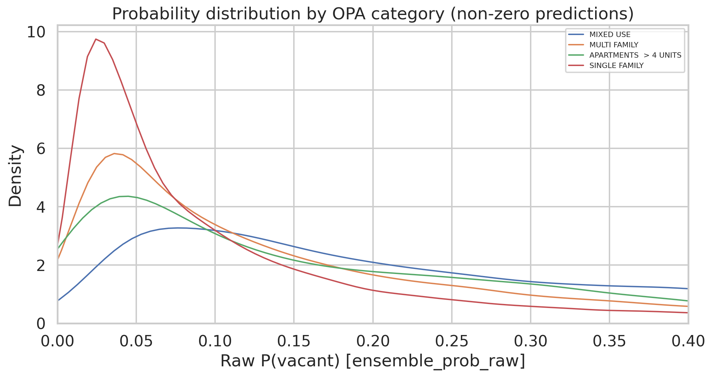

#### 16.4 Mean probability bar plus five-tier stack

Two charts are stacked vertically.

- **Chart A.** A horizontal bar chart showing mean predicted probability per category (blue bars) with observed OVS rate overlaid as red diamond markers. Bars and markers should roughly align for well-calibrated categories.
- **Chart B.** A stacked horizontal bar showing tier distribution within each category. The tier breaks here are designed for the actual log-skewed distribution rather than equal width. No Signal (zero), Low (0 to 5 percent), Moderate (5 to 20 percent), High (20 to 50 percent), Very High (over 50 percent).

The 0.0 to 0.2, 0.2 to 0.4, and so on equal-width tiers from VacancyGuide are still used in the operational five-tier rollups in step 9 and the tier badges in step 7. The log-spaced breaks here are for within-category visualization where almost all non-zero predictions fall below 20 percent.

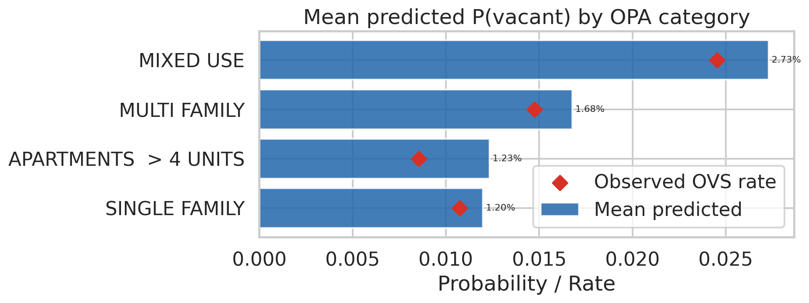

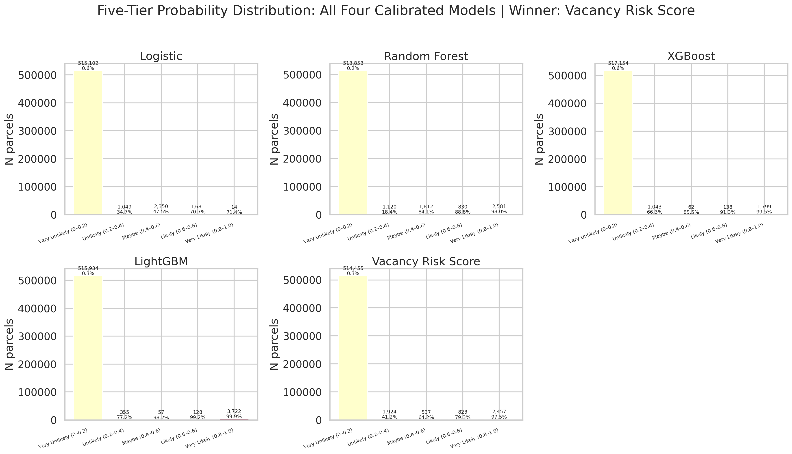

#### 16.5 Category calibration scatter

For each category with at least 200 parcels, mean predicted probability is plotted against observed vacancy rate, with point size proportional to parcel count. Points on the 45 degree diagonal are perfectly calibrated. Points above the diagonal indicate under-prediction (observed rate higher than predicted). Points below indicate over-prediction.

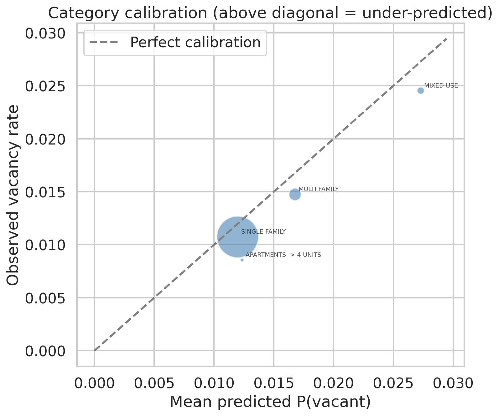

#### 16.6 ZIP code summary and bar chart

Mean predicted probability and observed OVS rate are computed per ZIP and ranked. The horizontal bar chart shows bars for predicted probability with observed rate overlaid as diamond markers. ZIP 19132 has the highest mean predicted probability at around 3.61 percent. ZIP 19137 has the lowest at around 0.85 percent.

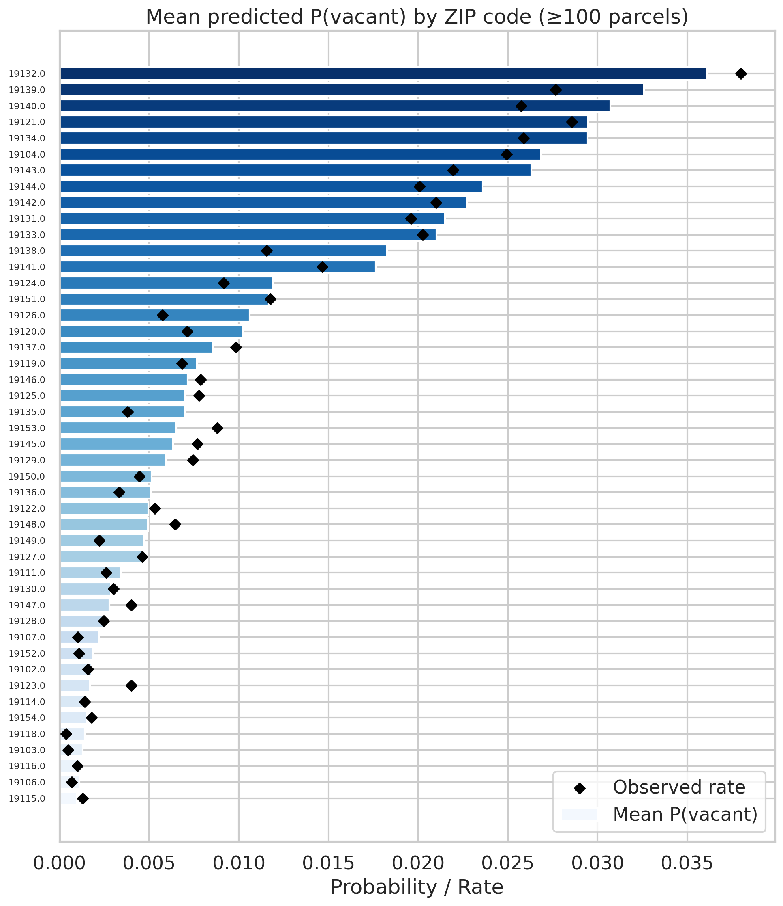

#### 16.7 ZCTA choropleth and interactive Leaflet map

`tigris::zctas(starts_with = "191")` downloads US Census ZCTA boundaries for Philadelphia ZIPs (a few MB). These are joined to the ZIP-level summary and rendered as a static choropleth, plus an interactive Leaflet map with hover highlighting and click popups showing ZIP, mean P(vacant), parcel count, and observed vacancy rate.

ZCTA boundaries are used rather than `PWD_PARCELS.geojson` for the static map because the parcel file is over 400 MB and consistently causes the R session to run out of memory or render at unusable resolutions. The parcel-resolution map lives separately in step 17 as a vector tileset that the browser handles efficiently.

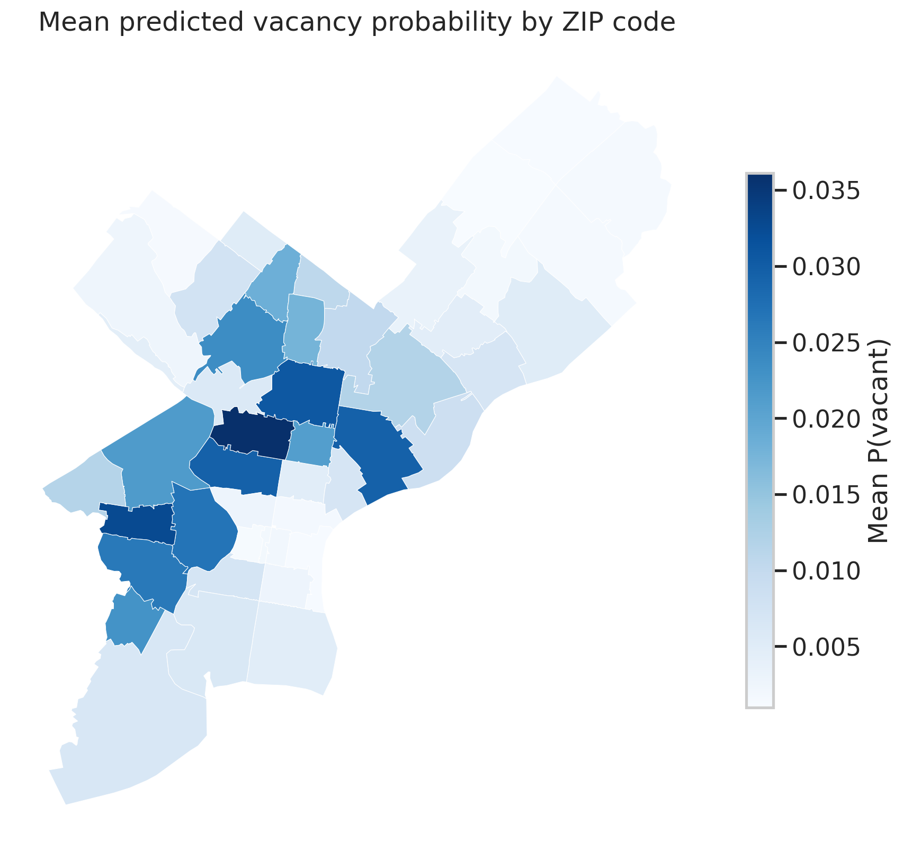

#### 16.8 Capacity-based threshold lookup

A precision-recall curve is computed across probability thresholds from 0.01 to 0.99 and each row is annotated with the corresponding number of parcels flagged. Common inspection volumes (100, 250, 500, 1,000, 2,000, 5,000, 10,000) are then read off the curve as a lookup table. To flag 5,000 parcels the table reports a threshold of around 0.67 with around 78 percent precision and around 67 percent recall. Operations teams can pick a row based on actual resourcing rather than commit to a fixed citywide threshold.

#### 16.9 Optional GeoJSON exports

When `PWD_PARCELS.geojson` is available, this step writes two GeoJSON files for downstream use.

- `data_py/vacancy_predictions.geojson`. Around 436K parcels, around 405 MB. All prediction columns plus all feature metadata.
- `data_py/vacancy_predictions_flagged.geojson`. Around 4,500 parcels (top one percent flagged), around 3.9 MB. Same column set, smaller geometry.

**Outputs.** `data_py/output_zip_summary.csv`, `data_py/output_category_summary.csv`, `data_py/capacity_threshold_curve.csv`, `data_py/vacancy_risk_map.html`, plus the two GeoJSON files and a folder of static PNGs under `graphs/python/`.

---

### Step 17. Vector Tilesets for Web Consumption

**File.** [`code/r_code/06_tiling.Rmd`](code/r_code/06_tiling.Rmd)

The 405 MB GeoJSON from step 16 is unusable in a browser as is. This step converts both GeoJSON exports into PMTiles, a single-file vector tileset format that the browser can stream from static storage (S3, GCS, GitHub Pages) and consume directly via MapLibre GL JS or Mapbox GL JS without a tile server.

#### 17.1 Toolchain

`tippecanoe` (version 2.80, Felt fork) is the converter. It is invoked via `system2()` from inside the Rmd. The Felt fork is required for the PMTiles output format. The vanilla tippecanoe binary writes mbtiles only.

#### 17.2 Flagged tileset

`vacancy_flagged.pmtiles` covers the top one percent flagged parcels. Around 4,500 features. Zoom 10 to 16. The layer name inside the tileset is `flagged`. At lower zooms tippecanoe coalesces the densest parcels so the tileset stays readable. Final file size is around 2.2 MB. This is the right tileset for high-zoom drill-down on the inspection target list.

#### 17.3 Full prediction tileset

`vacancy_predictions.pmtiles` covers all roughly 436K parcels. Zoom 10 to 15. The layer name inside the tileset is `parcels`. The pipeline applies a 10 unit simplification at low zooms and drops the densest features when tile size exceeds the limit. Final file size is around 46 MB.

Both tilesets carry the full feature property bag including `risk_score`, `ensemble_prob`, `qtile_tier`, `zip`, `tract`, `ward`, `address`, and `ovs`. Client-side styling and filtering are therefore possible without round-tripping to a server. A consumer can color by risk score, filter to flagged only, search by ZIP, or drill into a single parcel popup, all in the browser.

For visual sanity-checking the file `https://protomaps.github.io/PMTiles/` accepts a PMTiles URL and renders it.

**Outputs.** `data_py/tiles/vacancy_flagged.pmtiles` and `data_py/tiles/vacancy_predictions.pmtiles`.

---

## Cross-Notebook Headline Metrics

| Source | Method | Value |
|---|---|---|
| 04a, random 30 percent test | Calibrated ensemble ROC-AUC | 0.9395 |
| 04a, random 30 percent test | Calibrated ensemble PR-AUC | 0.5461 |
| 04a, random 30 percent test | Calibrated ensemble Brier | 0.0068 |
| 04b, 10-fold ZIP-grouped CV | RF mean AUC | 0.8877 plus or minus 0.0064 |
| 04b, LOGO sample of 15 ZIPs | RF mean AUC | 0.8849 |
| 04b_vpi, by income quintile | Quintile AUC range | 0.968 to 0.978 |
| 04b_vpi, by building category | Category AUC range | 0.942 to 0.980 |
| 04c, vs City VPI on residential | Ensemble AUC | 0.9786 |
| 04c, vs City VPI on residential | Ensemble PR-AUC | 0.7538 |
| 04c, vs City VPI on residential | VPI binary AUC | 0.7849 |
| 04c, at matched ~6.4K capacity | Ensemble precision / recall | 54.7 percent / 78.3 percent |
| 04c, at matched ~6.4K capacity | VPI precision / recall | 53.3 percent / 57.6 percent |
| 04d, evaluation half | Recalibrated ensemble AUC | 0.9375 |
| 04e, citywide at 1 percent ward capacity | Model precision / recall | 57.0 percent / 49.1 percent |
| 04g, new-cohort temporal proxy | Ensemble AUC | 0.9760 |
| 04g, old-cohort temporal proxy | Ensemble AUC | 0.9579 |
| 04h, 5-fold tract-grouped CV | RF mean AUC | 0.9677 plus or minus 0.0083 |

The most defensible number to cite for the model's generalization performance is the block-CV AUC of around 0.9677 from step 15. It controls for the leakage that random splits allow through neighborhood-level features and uses the right spatial granularity for how city operations actually play out.

---

## Key Design Decisions

| Decision | Choice | Reason |
|---|---|---|
| OVS definition | Three-source composite (C&S plus violations plus licenses) | No single source captures all vacancies. Composite reduces false negatives |
| Temporal anchor | TRAIN_CUTOFF equal to 2025-10-01 | Hard cutoff prevents any future data from influencing features or the label |
| C&S window | Two-year window plus demolition filter | Stale C&S records misrepresent current status. Demolished buildings are not vacant buildings |
| Residential scope | Category codes 1, 2, 3, 14 only | Buildings and land require different feature vocabularies. Commercial properties introduce systematic false positives |
| Commercial and parking filter | `bldg_desc` pattern match on PWD parcel layer | Catches parking garages and surface lots that survive the category code filter as mixed-use parcels |
| Life-history features | Trend and acceleration over 3yr, 5yr, 2yr windows | Single violation counts miss whether a property is getting worse, stable, or improving |
| RTT integration | Transfer frequency, sheriff sales, log price change | Full deed history adds distress signals not captured in OPA's single most-recent sale |
| Train and test split | Stratified random 70 / 30 | Temporal split caused distributional shift because recency is itself a vacancy proxy |
| Spatial validation | 10-fold ZIP-grouped CV plus LOGO CV plus 5-fold tract block CV | Tests generalization independent of spatial autocorrelation. LOGO simulates new geography. Tract block CV is the honest stakeholder-reportable AUC |
| No assessed value features | `log_market_value` and `value_per_sqft` excluded | OPA assessed values have documented racial and geographic bias |
| Production score is calibrated ensemble | 50 / 50 Logit and RF, isotonic at the end | Logit and RF capture different signal shape. Equal weighting beat tuned weighting in cross-validation. Isotonic restores honest empirical positive rates |
| No fixed binary threshold | Top one percent rank flag plus five-tier rank bucket | Calibrated probabilities are all small because vacancy is rare. A fixed 0.5 threshold flags almost nothing. Use rank or capacity instead |
| ZCTA boundaries for static maps | `tigris` package | `PWD_PARCELS.geojson` is over 400 MB. ZCTA is practical for rendering and presentations. Parcel-resolution lives in PMTiles |
| Per-ward capacity flagging | One percent of each ward's residential parcels | Single citywide threshold concentrates too many flags in a few neighborhoods. Per-ward keeps the inspection load sensible everywhere |
| 04b mirrors 04a exactly | Identical model_vars, recipe, hyperparameters | Spatial CV and LOGO CV must evaluate the same model that is deployed. Divergence would produce misleading validation metrics |
| No poverty rate in model | ACS variables removed from model_vars | Used only in the equity audits as an analysis dimension, not a feature. Avoids an external Census API dependency at training time |

---

## Output File Catalog

The following are the artefacts that downstream consumers (dashboards, GIS layers, inspection workflows) should rely on. Earlier or intermediate files are listed in the per-step sections above.

#### Production model artefacts (in `data_py/`)

- `model_logit_final.rds`. Fitted Logistic Regression pipeline.
- `model_rf_final.rds`. Fitted Random Forest pipeline.
- `model_xgb_final.rds`. Fitted XGBoost pipeline. Diagnostic comparator.
- `model_lgb_final.rds`. Fitted LightGBM pipeline. Diagnostic comparator.
- `calibrators.rds`. Original isotonic calibrators for each model and the ensemble.
- `calibrators_v2.rds`. Held-out recalibrated ensemble calibrator. Recommended for production going forward.
- `model_thresholds.csv`. Per-model Youden thresholds plus AUC, sensitivity, specificity, and `is_best`.

#### Parcel-level prediction frames

- `all_predictions_rf.csv`. One row per parcel with all probabilities, calibrated and raw, plus flag, risk_score, qtile_tier.
- `predictions_calibrated.csv`. Adds `ensemble_prob_v2` from the held-out calibrator.
- `predictions_04b.csv`. Predictions joined to ZIP, tract, ward, and category. The right starting point for analysis.
- `predictions_with_ci.csv`. Test-set predictions with RF tree-variance confidence interval bounds.
- `parcel_shap_topflags.csv`. Top 200 flagged parcels with five SHAP-attributed features each.
- `vs_city_vpi_parcel.csv`. Per-parcel ensemble probability versus City VPI flag.

#### Aggregated rollups

- `output_zip_summary.csv`. Per-ZIP mean predicted, observed rate, count.
- `output_category_summary.csv`. Per-category mean predicted, observed rate, count.
- `ward_summary_04b.csv`. Per-ward rollup including high-risk count.
- `zip_auc_04b.csv`. Per-ZIP AUC for ZIPs meeting the minimum-N filter.
- `equity_income_auc.csv`. Per-income-quintile AUC, observed rate, mean predicted.
- `equity_zip_audit.csv`. Per-ZIP flag rate versus observed vacancy rate.

#### Validation and diagnostics

- `spatial_cv_metrics.csv`. Per-fold ZIP-grouped CV AUC and J-Index.
- `logo_cv_metrics.csv`. Per-ZIP LOGO AUC for sampled ZIPs.
- `validation_summary.csv`. Headline cross-validation metrics.
- `block_cv_rf.csv`. Per-fold tract-grouped CV AUC.
- `temporal_validation.csv`. Old and new cohort metrics.
- `capacity_threshold_curve.csv`. Threshold to flagged-count to precision and recall lookup.
- `operational_flags_by_ward.csv`. Per-ward flag counts under the one-percent capacity policy.
- `operational_precision_at_capacity.csv`. Citywide model versus VPI versus union summary.
- `vs_city_vpi_headline.csv`. Headline comparison against City VPI.
- `vs_city_vpi_buckets.csv`. Four-bucket disagreement summary.
- `vs_city_vpi_zip.csv`. Per-ZIP head-to-head with City VPI.

#### Geospatial and interactive outputs

- `vacancy_risk_map.html`. Interactive folium ZCTA-level map.
- `vacancy_predictions.geojson`. Around 436K parcel polygons with all predictions.
- `vacancy_predictions_flagged.geojson`. Around 4,500 flagged parcels with all predictions.
- `tiles/vacancy_flagged.pmtiles`. Around 2.2 MB. Top one percent.
- `tiles/vacancy_predictions.pmtiles`. Around 46 MB. Full citywide.
- `vs_city_vpi_map.html`. Interactive bucket overlay.
- `vs_city_vpi_high_prob_ovs0_map.html`. Candidate-review map for high-probability OVS-equal-zero parcels.

---

## Website and Dashboard

Everything that gets handed to a non-technical audience lives in [`website/`](website/). The folder is fully static, ships with a graceful fallback for the Flask backend, and is designed to be pushed to GitHub Pages or any static host without modification.

### Public-facing pages

| File | Purpose |
|---|---|
| [`website/index.html`](website/index.html) | Tiny redirect that drops visitors onto the landing page |
| [`website/Vacancy Risk Landing Page.html`](website/Vacancy%20Risk%20Landing%20Page.html) | Project landing page. The "what this is and why it matters" surface for stakeholders |
| [`website/PhillyStat360 v2.html`](website/PhillyStat360%20v2.html) | Full methodology write-up. Mirrors the step-by-step structure of this README in a presentation-ready layout |
| [`website/dashboard.html`](website/dashboard.html) | Interactive parcel-level dashboard. MapLibre + PMTiles vector parcels, SHAP risk drivers per parcel, ward choropleth, sidebar summary cards, ward filter, and parcel search |

### Data shipped with the dashboard

The dashboard needs a small set of static files alongside the HTML. Each file is the direct output of a pipeline step.

| File | Source step | Purpose |
|---|---|---|
| `vacancy_predictions.pmtiles` (~46 MB) | Step 17 | Full citywide parcel tileset, layer name `parcels` |
| `vacancy_flagged.pmtiles` (~2.2 MB) | Step 17 | Top one percent flagged parcels, layer name `flagged` |
| `vacancy_predictions_flagged.geojson` (~3.9 MB) | Step 16 | Flagged parcels as GeoJSON for the SHAP table backend |
| `ward_boundaries.geojson` | Step 16 | Polygon geometry for the 66 political wards |
| `ward_stats.json` | Step 16 | Per-ward rollups used to power the choropleth, summary cards, and ward filter list in static mode |
| `dashboard_shap.json` | Step 13 | Per-parcel SHAP risk drivers for the dashboard's "why this parcel" panel |
| `colors_and_type.css` | — | Shared colour palette and type scale across landing page, methodology, and dashboard |

### Static vs. local-server mode

`dashboard.html` auto-detects the host. On `localhost` or `127.0.0.1` it tries the local Flask backend first ([`website/tileserver.py`](website/tileserver.py), backed by PostgreSQL/PostGIS via [`website/load_db.py`](website/load_db.py)). On any other host it skips the backend entirely and falls back to the JSON files above.

| Feature | Local-server mode | Static mode |
|---|---|---|
| Map basemap and PMTiles | CARTO basemap, vector parcels from `vacancy_predictions.pmtiles` | Same |
| Parcel popups (click) | Full property bag from PMTiles | Full property bag from PMTiles |
| SHAP risk drivers | `dashboard_shap.json` | `dashboard_shap.json` |
| Ward choropleth | `ward_stats.json` plus `ward_boundaries.geojson` | Same |
| Sidebar summary cards | `/summary` endpoint | Aggregated from `ward_stats.json` |
| Ward filter list | `/wards` endpoint | From `ward_stats.json` |
| Ward fly-to | `/ward_bounds` endpoint | Computed client-side from the ward boundary GeoJSON |
| Parcel search | DB-wide search via `/search` | Limited to parcels currently rendered in view (`queryRenderedFeatures`) |
| Census tract filter | `/census_tracts` and `/tract_bounds` | Disabled unless `census_tracts.json` is shipped |

The local Flask backend is optional. It exists for the case where the city wants DB-wide parcel search and tract-level filtering on a workstation. Everything in the public deployment is static.

### Deployment

Full GitHub Pages deployment notes live in [`website/DEPLOY.md`](website/DEPLOY.md). The short version is:

```bash
cd website
git init -b main
git add .gitignore .nojekyll .
git commit -m "Initial commit"
git remote add origin git@github.com:<you>/<repo>.git
git push -u origin main
# Settings → Pages → Source: Deploy from a branch, main / (root)
```

The two PMTiles files stay in the repo as ordinary objects rather than Git LFS, because GitHub Pages does not serve LFS objects through its CDN. The largest file (`vacancy_predictions.pmtiles`, around 46 MB) sits comfortably under GitHub's 100 MB per-file limit. To host the tilesets on S3, Cloudflare R2, or any other static bucket instead, set the `PMTILES_URL` constant at the top of the `<script>` block in `dashboard.html` to the absolute URL — the PMTiles JS reader will stream byte ranges over HTTP.

[`website/sync_methodology_assets.sh`](website/sync_methodology_assets.sh) copies the latest figures from `graphs/` and `code/outputs/` into the methodology page so the public write-up stays in sync with the modeling pipeline.

---

## Data Sources

All data from [OpenDataPhilly](https://opendataphilly.org) unless noted.

| File | Source | Purpose |
|---|---|---|
| `opa_properties_public.csv` | OPA | Parcel registry, property characteristics |
| `violations.csv` | L&I | Code violation history |
| `business_licenses.csv` | L&I | License history including vacant property licenses |
| `clean_seal.csv` | L&I | City-initiated boarding and securing actions |
| `unsafe.csv` | L&I | Unsafe structure orders |
| `imm_dang.csv` | L&I | Imminently dangerous structure orders |
| `permits.csv` | L&I | Building and zoning permits including demolition and new construction |
| `RTT_SUMMARY.csv` | Philadelphia Revenue | Full deed and transfer history |
| `VIOLATION_DEFINITION.csv` | L&I | Violation code title lookup |
| `vpi_bldg.geojson` | City of Philadelphia | Vacant Property Indicator binary flag |
| ACS 2022 5-year `B19013_001E` | US Census Bureau | Census-tract median household income for the equity audit |
